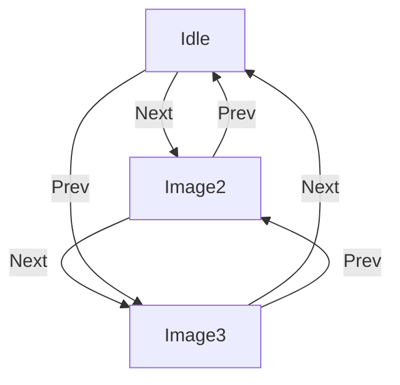

# Image Carousel System Design

*System design interview question: Design an image carousel component that displays a list of images one at a time, allowing the user to browse through them with pagination buttons.*

---

## Table of Contents
1. [Overview](#overview)
2. [Requirements Exploration](#requirements-exploration)
3. [Architecture & High-Level Design](#architecture--high-level-design)
4. [Data Model](#data-model)
5. [Interface Definition (API)](#interface-definition-api)
6. [Optimizations and Deep Dive](#optimizations-and-deep-dive)
7. [User Experience (UX)](#user-experience-ux)
8. [Performance, Caching, and Scalability](#performance-caching-and-scalability)
9. [Security, Privacy, and Compliance](#security-privacy-and-compliance)
10. [Analytics, Observability, and Testing](#analytics-observability-and-testing)
11. [Internationalization (i18n)](#internationalization-i18n)
12. [Accessibility (a11y)](#accessibility-a11y)
13. [Customization, Theming, and Extensibility](#customization-theming-and-extensibility)
14. [Error Handling and Edge Cases](#error-handling-and-edge-cases)
15. [Device Compatibility and Production Readiness](#device-compatibility-and-production-readiness)
16. [Changelog](#changelog)
17. [References](#references)

---

## 1. Overview

Image carousels are a ubiquitous UI component for displaying a sequence of images (or other content) one at a time, with navigation controls for browsing. They are used in product galleries, photo feeds, onboarding flows, dashboards, and more. A robust carousel must be accessible, performant, customizable, secure, and work across all devices and locales. This document provides a deep, technical dive into the architecture, data model, APIs, rendering, accessibility, real-world trade-offs, and production considerations for building a modern, enterprise-grade image carousel component.


---

## 2. Requirements Exploration

### Core Features
- Display a list of images, one at a time
- Pagination buttons for navigation (Prev/Next)
- Progress dots for direct navigation
- Infinite cycling (wraps at start/end)
- Horizontal animation between images
- Configurable via component props
- Works on desktop, tablet, and mobile
- Support for keyboard, mouse, and touch navigation
- Support for both controlled and uncontrolled usage

### Advanced/Optional Features
- Autoplay (with pause on interaction)
- Customizable transition effects (slide, fade, zoom)
- Lazy loading and preloading of images
- Responsive and adaptive layouts
- Theming and design system integration
- Analytics hooks for user interaction
- Accessibility (WCAG, ARIA, keyboard, screen reader)
- RTL (right-to-left) support
- Device-specific image selection (srcset, picture)
- Virtualization for large image sets
- Error handling for failed image loads
- Security and privacy compliance (CSP, alt text, no tracking)

### Real-Life Examples
- [Amazon](https://www.amazon.com/)
- [Dropbox](https://www.dropbox.com/)
- [Google](https://www.google.com/)
- [Microsoft](https://www.microsoft.com/)

---

## 3. Architecture & High-Level Design

### Client-Side Only
- No server data required; all images specified via configuration
- Can be used in SPAs, MPAs, or embedded in CMSs

### Architecture Diagram


#### Component Responsibilities
| Component         | Responsibility                                                                 |
|-------------------|-------------------------------------------------------------------------------|
| ViewModel/Model   | Holds configuration and state, orchestrates events, determines which image to render |
| Image             | Displays the currently selected image                                          |
| Prev/Next Buttons | Change to previous/next image                                                  |
| Progress Dots     | Jump to a specific image                                                       |
| Timer             | (Optional) Advances images in autoplay mode                                    |

- Flux/Redux/Reducer-like architecture recommended for action abstraction
- Actions can be triggered by UI, timer (autoplay), or keyboard
- Separation of concerns: state management, rendering, event handling

#### Example State Machine Diagram


#### Example Redux Actions
```ts
type CarouselAction =
  | { type: 'NEXT_IMAGE' }
  | { type: 'PREV_IMAGE' }
  | { type: 'SHOW_IMAGE'; index: number }
  | { type: 'START_AUTOPLAY' }
  | { type: 'STOP_AUTOPLAY' };
```

---

## 4. Data Model

### State & Configuration
- **Configuration:**
  - List of images (URL, alt text, optional metadata, device-specific sources)
  - Transition duration (ms)
  - Size: height, width, aspect ratio
  - Animation type (slide, fade, custom)
  - Looping, autoplay, delay, theming, event hooks
- **State:**
  - Index of current image
  - Timer state (if autoplay)
  - Loading/error state for each image
  - Focus/interaction state (for accessibility)

#### Example TypeScript Types
```ts
interface CarouselImage {
  src: string;
  alt: string;
  srcSet?: string;
  sizes?: string;
  metadata?: Record<string, any>;
}

interface CarouselConfig {
  images: CarouselImage[];
  transitionDuration: number;
  height: number;
  width: number;
  animationType?: 'slide' | 'fade' | 'zoom' | 'custom';
  loop?: boolean;
  autoplay?: boolean;
  delay?: number;
  theme?: string | object;
  onLoad?: () => void;
  onPageSelect?: (index: number) => void;
  onNextClick?: () => void;
  onPrevClick?: () => void;
  ariaLabels?: { prev: string; next: string };
}
```

---

## 5. Interface Definition (API)

### Basic API
- **images:** Array of image objects (`{ src, alt, srcSet, ... }`)
- **transitionDuration:** Duration for animation (ms)
- **height:** Height of carousel (px)
- **width:** Width of carousel (px)

#### Example (React):
```jsx
<ImageCarousel
  images={[
    { src: 'https://example.com/images/foo.jpg', alt: 'A foo', srcSet: '...', sizes: '...' },
    { src: 'https://example.com/images/bar.jpg', alt: 'A bar' },
    // ...
  ]}
  transitionDuration={300}
  height={500}
  width={800}
/>
```

### Advanced API
- **autoplay:** Automatically advance images
- **delay:** Delay between transitions (ms)
- **event listeners:** `onLoad`, `onPageSelect`, `onNextClick`, `onPrevClick`
- **theming:** Custom styles, className, CSS variables, theme object
- **loop:** Enable/disable infinite cycling
- **animationType:** 'slide', 'fade', 'zoom', or custom
- **ariaLabels:** Custom ARIA labels for accessibility
- **virtualization:** Only render visible images for large sets
- **errorFallback:** Custom fallback UI for failed image loads

#### Example Props Table
| Prop              | Type                | Default   | Description                                      |
|-------------------|---------------------|-----------|--------------------------------------------------|
| images            | CarouselImage[]     |           | List of images                                   |
| transitionDuration| number              | 300       | Animation duration (ms)                          |
| height            | number              | 400       | Carousel height (px)                             |
| width             | number              | 600       | Carousel width (px)                              |
| autoplay          | boolean             | false     | Enable autoplay                                  |
| delay             | number              | 3000      | Delay between transitions (ms)                   |
| loop              | boolean             | true      | Enable infinite cycling                          |
| animationType     | string              | 'slide'   | Animation type                                   |
| theme             | string/object       | undefined | Theming options                                  |
| ariaLabels        | object              |           | ARIA labels for buttons                          |
| virtualization    | boolean             | false     | Enable virtualization for large sets             |
| errorFallback     | ReactNode/function  | undefined | Fallback UI for image load errors                |

### Internal API
| API            | Source                        | Description                        |
|----------------|-------------------------------|------------------------------------|
| prevImage()    | Prev Button/Keyboard/Timer    | Show previous image                |
| nextImage()    | Next Button/Keyboard/Timer    | Show next image                    |
| showImage(idx) | Progress Dots                 | Jump to specific image             |
| startAutoplay()| Timer                         | Start autoplay                     |
| stopAutoplay() | Timer/Interaction             | Stop autoplay                      |

---

## 6. Optimizations and Deep Dive

### Layout Implementation
- **Flexbox:** Render images in a horizontal row, change scroll offset to show selected image
- **Grid/Absolute Positioning:** For custom transitions (fade, zoom)
- **Diagram:**
  
- **Sample Code:**
  ```html
  <div class="carousel-images">
    
    <!-- More images -->
  </div>
  ```
  ```css
  .carousel-images { display: flex; height: 400px; width: 600px; overflow: hidden; }
  .carousel-image { height: 400px; width: 600px; object-fit: contain; }
  ```
- **Scroll to image:**
  ```js
  document.querySelector('.carousel-images').scrollTo({
    left: selectedIndex * 600,
    behavior: 'smooth',
  });
  ```

### Fitting Images
- Use CSS `object-fit: contain` or `cover` for `` tags
- Allow developer to customize fit mode per image/component
- Support for aspect-ratio CSS property
- Optionally allow per-image sizing/fit overrides

### Vertically Center Buttons
- Use `position: absolute; top: 50%; transform: translateY(-50%)` for buttons
- Example:
  ```css
  .carousel-button { position: absolute; top: 50%; transform: translateY(-50%); }
  .carousel-button-prev { left: 30px; }
  .carousel-button-next { right: 30px; }
  ```
- Consider z-index and focus ring for accessibility

### Animation Techniques
- CSS transitions for slide/fade
- requestAnimationFrame for custom/complex animations
- Use React Spring/Framer Motion for advanced effects
- Reduce motion for accessibility (prefers-reduced-motion)

### State Management
- Use React useReducer, Redux, Zustand, or Context for state
- Decouple state from rendering for testability
- Support controlled/uncontrolled usage

### Event Handling
- Debounce rapid navigation to avoid animation glitches
- Pause autoplay on user interaction
- Expose hooks for analytics and custom logic

---

## 7. User Experience (UX)
- **Scroll snapping:** Use [CSS scroll snap](https://developer.mozilla.org/en-US/docs/Web/CSS/scroll-snap-type) for smooth, native-feeling swiping
- **Large interactive elements:** Buttons at least 44x44px for mobile
- **Reposition buttons:** Place Prev/Next close together for faster navigation
- **Hide dots on mobile:** Dots can be too small for touch
- **Autoplay:** Timer advances images, cancels on manual navigation
- **Looping:** Infinite cycling at start/end
- **Touch gestures:** Swipe left/right to navigate
- **Keyboard navigation:** Arrow keys, Home/End, focus management
- **Focus indicators:** Visible focus for accessibility
- **Responsive design:** Adapts to container size, orientation, and device
- **RTL support:** Layout and navigation direction adapt to locale
- **Customizable transitions:** Slide, fade, zoom, or custom
- **Loading indicators:** Show spinner or skeleton while loading
- **Error feedback:** Show fallback or error message on image load failure
- **Accessibility hints:** ARIA live regions for announcements

---

## 8. Performance, Caching, and Scalability
- **Defer loading of offscreen images:** Use `` or JS
- **Preload next images:**
  ```js
  const preloadImage = new Image();
  preloadImage.src = url;
  ```
- **Airbnb example:**
  
- **Device-specific images:** Use `srcset` or `<picture>` for responsive images
- **Virtualized lists:** Render only visible images if many
- **Image CDN:** Use CDN for fast image delivery
- **HTTP caching:** Leverage browser and CDN caching
- **Optimize image formats:** Use WebP, AVIF, JPEG XL for modern browsers
- **Adaptive loading:** Serve lower-res images on slow connections
- **Minimize reflows:** Avoid layout thrashing during transitions
- **Reduce bundle size:** Code split carousel logic if possible

---

## 9. Security, Privacy, and Compliance
- **Alt text required:** Prevents privacy leaks and improves accessibility
- **No tracking pixels:** Ensure images do not leak user data
- **CSP compliance:** Avoid inline scripts/styles, use trusted sources
- **No XSS:** Sanitize all dynamic content (alt, src)
- **No external JS:** Avoid 3rd-party scripts unless vetted
- **GDPR/CCPA:** No personal data in image URLs or metadata
- **No autoplay with sound:** Avoids accessibility and privacy issues

---

## 10. Analytics, Observability, and Testing
- **Analytics hooks:** Expose events for page select, next/prev, image load
- **A/B testing:** Support for variant transitions, layouts, or features
- **Error reporting:** Log image load failures, JS errors
- **Performance monitoring:** Track load times, interaction latency
- **Unit tests:** Test state transitions, rendering, event handling
- **Integration tests:** Simulate user navigation, keyboard, touch
- **Accessibility tests:** Use axe, Lighthouse, or jest-axe
- **Visual regression:** Use Percy, Chromatic, or Storybook

---

## 11. Internationalization (i18n)
- Allow customizing `aria-label` strings for Prev/Next buttons
- Support RTL layouts if needed
- Localize all visible text, tooltips, and error messages
- Support for different number/date/currency formats in captions
- Use CSS logical properties for layout (margin-inline, etc.)

---

## 12. Accessibility (a11y)
- **Mobile-friendliness:** Large touch targets, swipe support
- **Screen readers:** `` tags with meaningful `alt` or empty string; `aria-label` for buttons
- **Keyboard support:**
  - `<button>` for Prev/Next (focusable)
  - `<div role="region" aria-label="Image Carousel" tabindex="0">` for focusable carousel
  - Left/Right keydown handlers for navigation
- **Focus management:** Focus indicators, trap focus if needed
- **ARIA live regions:** Announce image changes
- **Reduced motion:** Respect user preferences
- **Tab order:** Logical and predictable
- **Skip links:** Allow skipping carousel for screen readers
- **WCAG compliance:** Meets AA/AAA as needed

---

## 13. Customization, Theming, and Extensibility
- **Theming:** Support for CSS variables, theme objects, or design tokens
- **Custom transitions:** Allow user to provide custom animation logic
- **Slot-based composition:** Allow custom buttons, dots, overlays
- **Extensible event system:** Custom hooks for analytics, logging, etc.
- **Integration:** Compatible with design systems (e.g., Material UI, Chakra)
- **SSR/SSG support:** Render correctly in Next.js, Gatsby, etc.
- **Plugin architecture:** Allow for plugins (e.g., captions, zoom, video)

---

## 14. Error Handling and Edge Cases
- **Image load failure:** Show fallback UI, retry, or skip
- **Empty image list:** Show placeholder or hide carousel
- **Duplicate images:** Handle gracefully
- **Rapid navigation:** Debounce or throttle to avoid glitches
- **Autoplay edge cases:** Pause on hover/focus, resume on blur
- **Resize events:** Recalculate layout on container resize
- **Memory leaks:** Clean up timers, listeners on unmount
- **SSR hydration mismatches:** Ensure consistent markup

---

## 15. Device Compatibility and Production Readiness
- **Cross-browser:** Chrome, Firefox, Safari, Edge, IE11 fallback
- **Touch devices:** iOS, Android, tablets
- **High-DPI/Retina:** Use high-res images where available
- **Offline support:** Use Service Workers for caching (optional)
- **Graceful degradation:** Works without JS (basic version)
- **Performance budgets:** Keep JS/CSS size minimal
- **Monitoring:** Track errors and usage in production
- **Documentation:** Provide clear usage and API docs

---

## 16. Changelog
- **2023/01/22:**
  - Mention Flux architecture
  - Expand on theming
  - Add Airbnb image carousel example
- **2024/06/XX:**
  - Major expansion: Added advanced topics, security, analytics, testing, error handling, device compatibility, customization, theming, extensibility, and production readiness. Deepened all technical sections and added more code, tables, and diagrams.

---

## 17. References
- [Creating an Accessible Image Carousel](https://www.aleksandrhovhannisyan.com/blog/image-carousel-tutorial/)
- [Designing A Perfect Carousel UX](https://www.smashingmagazine.com/2022/04/designing-better-carousel-ux/)
- [A Content Slider](https://inclusive-components.design/a-content-slider/)
- [React Responsive Carousel (open source)](https://github.com/leandrowd/react-responsive-carousel)
- [Airbnb Engineering: Faster Web Experience](https://medium.com/airbnb-engineering/building-a-faster-web-experience-with-the-posttask-scheduler-276b83454e91)
- [MDN: object-fit](https://developer.mozilla.org/en-US/docs/Web/CSS/object-fit)
- [MDN: scroll-snap-type](https://developer.mozilla.org/en-US/docs/Web/CSS/scroll-snap-type)
- [WCAG Guidelines](https://www.w3.org/WAI/standards-guidelines/wcag/)

---

This document provides an exhaustive, technical overview of the design and implementation of a modern image carousel component. It covers architectural decisions, data modeling, API, rendering, accessibility, customization, performance, security, analytics, testing, and real-world trade-offs, serving as a reference for advanced system design interviews and production-grade implementations.