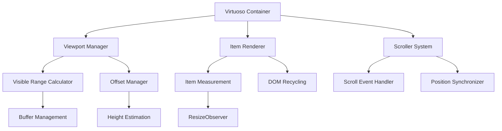
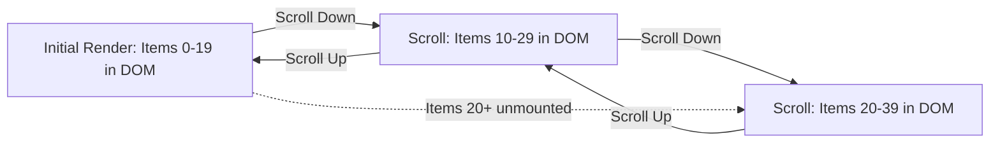

# React Virtuoso: Deep Dive into Virtual Scrolling

_Master React Virtuoso's virtualization engine, covering implementation details, offset management, variable height handling, and performance optimization strategies for building high-performance lists_

---

React Virtuoso is the most powerful virtual list component for React, providing efficient rendering of large datasets through sophisticated virtualization techniques. Unlike traditional approaches that render all items at once, Virtuoso renders only visible items plus a configurable buffer, dramatically improving performance and memory usage. This guide explores how React Virtuoso works under the hood, examining its core algorithms, offset management, variable height handling, and optimization strategies.

---

## Table of Contents

1. [Core Virtualization Concepts](#core-virtualization-concepts)
2. [Architecture Overview](#architecture-overview)
3. [Viewport Management](#viewport-management)
4. [Offset Calculation & Management](#offset-calculation--management)
5. [Variable Height Item Handling](#variable-height-item-handling)
6. [Scroll Synchronization](#scroll-synchronization)
7. [Performance Optimization Strategies](#performance-optimization-strategies)
8. [Component Variants](#component-variants)
9. [Advanced Features](#advanced-features)
10. [Common Patterns & Best Practices](#common-patterns--best-practices)

---

## Core Virtualization Concepts

### What is Virtualization?

Virtualization is a rendering optimization technique that renders only the items currently visible in the viewport, plus a small buffer of items above and below for smooth scrolling. This approach transforms O(n) rendering complexity to O(1) relative to the total dataset size.

**The Problem:** Traditional list rendering creates DOM nodes for every single item in your dataset. If you have 10,000 items, the browser creates 10,000 DOM nodes, leading to memory bloat and sluggish performance.

**The Solution:** Virtual scrolling maintains the illusion of a full list while only rendering the items currently visible to the user. This dramatically reduces DOM size and maintains consistent performance regardless of data size.

The following code comparison demonstrates the fundamental difference between traditional and virtualized approaches:

```jsx
// Traditional approach - renders ALL items (performance killer)
// 🔴 PROBLEM: If items array has 10,000 elements, browser creates 10,000 DOM nodes
// Memory usage: High (scales with data size)
// Initial render time: Slow (scales with data size)
// Scroll performance: Degrades as list size increases
function TraditionalList({ items }) {
  return (
    <div style={{ height: "400px", overflow: "auto" }}>
      {items.map((item, index) => (
        <div key={index}>{item.content}</div> // Creates DOM node for EVERY item
      ))}
    </div>
  );
}

// Virtualized approach - renders ONLY visible items
// ✅ SOLUTION: Only renders ~20 items regardless of total dataset size
// Memory usage: Constant (independent of data size)
// Initial render time: Fast (always renders same amount)
// Scroll performance: Consistent at any scale
import { Virtuoso } from "react-virtuoso";

function VirtualizedList({ items }) {
  return (
    <Virtuoso
      style={{ height: "400px" }} // Fixed container height
      totalCount={items.length} // Total number of items (for scroll calculations)
      itemContent={(
        index // Render function called only for visible items
      ) => (
        <div>{items[index].content}</div> // Only creates DOM nodes for visible items
      )}
    />
  );
}
```

**Key Differences Explained:**

- **Traditional List**: Creates DOM nodes for all 10,000 items immediately
- **Virtualized List**: Creates DOM nodes for only ~20 visible items
- **Memory Impact**: Virtualized approach uses 99.8% less DOM nodes
- **Performance**: Virtualized rendering time stays constant regardless of data size

### Key Benefits

- **Memory Efficiency**: DOM contains only visible items (~10-50 elements instead of thousands)
- **Consistent Performance**: Rendering time remains constant regardless of dataset size
- **Smooth Scrolling**: Optimized rendering pipeline prevents janky scroll behavior
- **Variable Heights**: Automatic measurement and adjustment for dynamic content

---

## Architecture Overview

React Virtuoso's architecture consists of several interconnected systems working together to provide seamless virtualization:

### Core Components



### State Management System

Virtuoso uses a reactive state management system that efficiently updates only necessary parts when data changes. This internal state tracks everything needed to maintain the virtualization illusion while keeping performance optimal.

**What This State Manages:**

- **Viewport Tracking**: Current scroll position and container dimensions
- **Item Visibility**: Which items are currently visible and need rendering
- **Height Measurements**: Actual measured heights vs estimated heights
- **Scroll Calculations**: Total scrollable area and item positioning

**State Update Flow:**

1. User scrolls → `scrollTop` updates
2. Visible range calculator runs → `visibleRange` updates
3. New items render if range changed → DOM updates
4. Height measurements update → `itemHeights` and `totalHeight` update

Here's a simplified representation of Virtuoso's internal state structure:

```jsx
// Simplified internal state structure
// This represents the core data that Virtuoso tracks internally
const virtuosoState = {
  // === VIEWPORT DIMENSIONS ===
  viewportHeight: 400, // Height of visible container (400px)
  scrollTop: 0, // Current scroll position from top

  // === ITEM MANAGEMENT ===
  totalCount: 10000, // Total number of items in dataset
  visibleRange: {
    // Currently rendered items (what user sees)
    start: 45, // First visible item index
    end: 65, // Last visible item index (renders items 45-65)
  },
  overscan: {
    // Buffer items (rendered but not visible)
    start: 40, // Extra items rendered above viewport
    end: 70, // Extra items rendered below viewport
  },

  // === HEIGHT TRACKING ===
  itemHeights: new Map([
    // Actual measured heights for each item
    [0, 48], // Item 0 is 48px tall
    [1, 52], // Item 1 is 52px tall
    [2, 45], // Item 2 is 45px tall
    // ... only measured items stored
  ]),
  estimatedItemHeight: 50, // Default height for unmeasured items
  totalHeight: 500000, // Total scrollable height (all items combined)

  // === OFFSET CALCULATIONS ===
  itemOffsets: new Map([
    // Cached Y positions for each item
    [0, 0], // Item 0 starts at Y position 0
    [1, 48], // Item 1 starts at Y position 48
    [2, 100], // Item 2 starts at Y position 100
    // ... calculated on demand
  ]),
  scrollOffset: 2250, // Current scroll offset in pixels
};
```

**State Efficiency Features:**

- **Lazy Calculation**: Heights and offsets calculated only when needed
- **Incremental Updates**: Only affected portions recalculated on changes
- **Memory Optimization**: Unmeasured items use estimated values
- **Cache Invalidation**: Smart cache clearing when item heights change

---

## Viewport Management

### Visible Range Calculation

The viewport manager is the brain of virtualization - it determines exactly which items should be rendered based on the current scroll position and container dimensions. This is the core algorithm that makes virtualization possible.

**How It Works:**

1. **Find First Visible Item**: Uses binary search to efficiently locate the first item that intersects with the viewport
2. **Calculate End Boundary**: Accumulates item heights until viewport height is filled
3. **Return Range**: Provides start/end indices for rendering

**Performance Optimization:**

- Binary search reduces time complexity from O(n) to O(log n)
- Only calculates what's needed for current viewport
- Caches results to avoid redundant calculations

**Input/Output Example:**

- **Input**: `scrollTop: 1200px`, `viewportHeight: 400px`, `itemHeight: 50px`
- **Process**: Binary search finds item at position 1200px (item #24)
- **Output**: `{ start: 24, end: 32 }` (renders 8 items to fill 400px)

Here's the core visible range calculation algorithm that powers Virtuoso:

```jsx
// Simplified visible range calculation algorithm
// INPUT: Current scroll position, viewport size, item positions, total items
// OUTPUT: Start and end indices of items that should be rendered
function calculateVisibleRange(
  scrollTop, // Current scroll position (e.g., 1200px)
  viewportHeight, // Height of visible area (e.g., 400px)
  itemOffsets, // Map of item index -> Y position
  totalCount // Total number of items in dataset
) {
  // STEP 1: Find first visible item using binary search for efficiency
  // Binary search is O(log n) vs linear search O(n)
  const startIndex = binarySearchFirstVisible(scrollTop, itemOffsets);

  // STEP 2: Calculate end index by accumulating heights until viewport is filled
  let endIndex = startIndex;
  let accumulatedHeight = 0;

  // Keep adding items until we've filled the viewport height
  while (endIndex < totalCount && accumulatedHeight < viewportHeight) {
    accumulatedHeight += getItemHeight(endIndex, itemOffsets);
    endIndex++;
  }

  // Add one extra item to handle partial visibility at bottom
  endIndex = Math.min(endIndex + 1, totalCount);

  return { start: startIndex, end: endIndex };
}

// Binary search to find first visible item efficiently
// Instead of checking every item from 0, we use binary search for O(log n) performance
function binarySearchFirstVisible(scrollTop, itemOffsets) {
  let left = 0; // Start of search range
  let right = itemOffsets.size - 1; // End of search range

  // Binary search: repeatedly halve the search space
  while (left < right) {
    const mid = Math.floor((left + right) / 2); // Middle point
    const offset = itemOffsets.get(mid) || 0; // Y position of middle item

    if (offset < scrollTop) {
      // Middle item is above scroll position, search upper half
      left = mid + 1;
    } else {
      // Middle item is at or below scroll position, search lower half
      right = mid;
    }
  }

  return left; // First item that intersects viewport
}

// Helper function to get item height (measured or estimated)
function getItemHeight(index, itemOffsets) {
  // Return actual measured height if available, otherwise use estimate
  return itemOffsets.has(index + 1)
    ? itemOffsets.get(index + 1) - itemOffsets.get(index)
    : 50; // Default estimated height
}
```

**Algorithm Efficiency:**

- **Binary Search**: O(log n) to find first visible item
- **Linear Accumulation**: O(k) where k = number of visible items (~10-20)
- **Total Complexity**: O(log n + k) instead of O(n) for naive approaches

### Overscan (Buffer) Management

Overscan (also called "buffer") is a critical optimization that renders additional items outside the visible viewport. This prevents blank spaces during fast scrolling and ensures users never see empty content while new items are being rendered.

**Why Overscan is Essential:**

- **Prevents Flash of Empty Content**: Without overscan, users see blank spaces during fast scrolling
- **Smooth Scroll Experience**: Pre-rendered items appear instantly when scrolled into view
- **Accommodation for Variable Scroll Speeds**: Faster scrolling needs larger buffers

**The Trade-off:**

- **More Overscan**: Smoother experience but higher memory usage
- **Less Overscan**: Better performance but potential stuttering

**Overscan Calculation Process:**

1. Calculate visible range (items 20-30)
2. Add overscan buffer (5 items above, 5 below)
3. Final render range: items 15-35
4. User scrolls and process repeats

Here are different overscan configuration options and their impact:

```jsx
// Overscan configuration affects performance vs smoothness trade-off
// Choose based on your specific use case and performance requirements

// OPTION 1: Pixel-based overscan (recommended for most cases)
// Renders extra content by pixel amount rather than item count
<Virtuoso
  totalCount={10000}
  itemContent={(index) => <Item key={index} />}
  // Render 200px worth of items above and below visible area
  // Good for: Variable height items, consistent buffer size
  increaseViewportBy={{
    top: 200,     // 200px of content above viewport
    bottom: 200   // 200px of content below viewport
  }}
/>

// OPTION 2: Item count-based overscan (simpler configuration)
// Renders fixed number of extra items regardless of their height
<Virtuoso
  totalCount={10000}
  itemContent={(index) => <Item key={index} />}
  // Render 5 extra items above and below visible area
  // Good for: Fixed height items, predictable buffer size
  overscan={5}  // Total: 10 extra items (5 above + 5 below)
/>

// OPTION 3: Dynamic overscan based on scroll velocity (advanced)
// Adjusts buffer size based on how fast user is scrolling
<Virtuoso
  totalCount={10000}
  itemContent={(index) => <Item key={index} />}
  // Function receives scroll velocity and returns overscan count
  // Good for: Optimizing for both performance and UX
  overscan={(velocity) => {
    // Slow scrolling: small buffer (better performance)
    if (Math.abs(velocity) < 100) return 3;
    // Medium scrolling: medium buffer
    if (Math.abs(velocity) < 500) return 8;
    // Fast scrolling: large buffer (smoother experience)
    return 15;
  }}
/>
```

**Overscan Strategy Guidelines:**

- **Small overscan (2-5 items)**:

  - ✅ Better performance (fewer DOM nodes)
  - ✅ Lower memory usage
  - ❌ Potential scroll stuttering during fast scrolling
  - **Best for**: Performance-critical apps, mobile devices

- **Medium overscan (6-10 items)**:

  - ✅ Good balance of performance and smoothness
  - ✅ Handles most scroll speeds well
  - **Best for**: General purpose applications

- **Large overscan (10-20 items)**:

  - ✅ Smoothest scrolling experience
  - ✅ No blank content during fast scrolling
  - ❌ Higher memory usage
  - ❌ More DOM nodes to manage
  - **Best for**: Premium UX applications, desktop apps

- **Dynamic overscan**:
  - ✅ Adapts to user behavior
  - ✅ Optimal balance for varying scroll patterns
  - ❌ More complex to configure
  - **Best for**: Apps with diverse scrolling patterns

---

## Offset Calculation & Management

### Height-Based Offset System

React Virtuoso maintains a sophisticated offset calculation system that tracks the exact Y-position of each item in the virtual list. This system is crucial for positioning items correctly and maintaining scroll accuracy as item heights change.

**What Are Offsets?**

- **Offset**: The Y-coordinate distance from the top of the list to the start of each item
- **Purpose**: Allows precise positioning of items during virtualization
- **Example**: If items 0-2 are 50px each, then item 3's offset is 150px

**Why Offset Management is Complex:**

- Items can have variable heights (images, dynamic content)
- Heights change after content loads (images, async data)
- Need to maintain scroll position when heights change
- Must be efficient for thousands of items

**Offset Calculation Strategy:**

1. **Lazy Calculation**: Only calculate offsets when needed
2. **Caching**: Store calculated offsets to avoid recalculation
3. **Incremental Updates**: When heights change, only update affected items
4. **Height Estimation**: Use estimated heights for unmeasured items

Here's how Virtuoso's internal offset management system works:

```jsx
// Internal offset management system
// This class handles the complex task of tracking item positions in a virtual list
class OffsetManager {
  constructor() {
    this.itemHeights = new Map(); // Actual measured heights: {0: 45, 1: 52, 2: 48}
    this.itemOffsets = new Map(); // Cached Y positions: {0: 0, 1: 45, 2: 97}
    this.totalHeight = 0; // Total scrollable height
    this.estimatedItemHeight = 50; // Default height for unmeasured items
  }

  // Calculate offset for a specific item (Y position from top)
  // INPUT: Item index (e.g., 5)
  // OUTPUT: Y position in pixels (e.g., 250px)
  getItemOffset(index) {
    // OPTIMIZATION: Return cached offset if available
    if (this.itemOffsets.has(index)) {
      return this.itemOffsets.get(index);
    }

    // CALCULATION: Sum heights of all previous items
    let offset = 0;
    for (let i = 0; i < index; i++) {
      offset += this.getItemHeight(i); // Add height of each previous item
    }

    // CACHING: Store calculated offset for future use
    this.itemOffsets.set(index, offset);
    return offset;
  }

  // Get item height (measured or estimated)
  // Returns actual measured height if available, otherwise uses estimation
  getItemHeight(index) {
    // Return measured height if we have it, otherwise use estimate
    return this.itemHeights.get(index) || this.estimatedItemHeight;
  }

  // Update height and recalculate affected offsets
  // Called when ResizeObserver detects item height change
  setItemHeight(index, height) {
    const oldHeight = this.getItemHeight(index);

    // EARLY EXIT: No change in height, nothing to update
    if (oldHeight === height) return;

    // UPDATE: Store new measured height
    this.itemHeights.set(index, height);

    // CACHE INVALIDATION: Clear cached offsets for items after this one
    // Why? Because their Y positions have shifted due to height change
    this.invalidateOffsetsAfter(index);

    // TOTAL HEIGHT UPDATE: Adjust total scrollable area
    const heightDelta = height - oldHeight;
    this.totalHeight += heightDelta;

    // SCROLL POSITION PRESERVATION: Adjust scroll if needed
    this.adjustScrollForHeightChange(index, heightDelta);
  }

  // Invalidate cached offsets for items after changed item
  // This forces recalculation when these items are next accessed
  invalidateOffsetsAfter(index) {
    for (let i = index + 1; i < this.totalCount; i++) {
      this.itemOffsets.delete(i); // Remove cached offset
    }
  }

  // Maintain scroll position when item heights change
  // Prevents jarring scroll jumps when content loads
  adjustScrollForHeightChange(changedIndex, heightDelta) {
    const currentScrollTop = this.scrollContainer.scrollTop;
    const changedItemOffset = this.getItemOffset(changedIndex);

    // If changed item is above current scroll position, adjust scroll
    if (changedItemOffset < currentScrollTop) {
      this.scrollContainer.scrollTop = currentScrollTop + heightDelta;
    }
  }

  // Batch update multiple heights efficiently
  // Used when multiple items change size simultaneously
  batchUpdateHeights(heightUpdates) {
    let totalDelta = 0;
    let minChangedIndex = Infinity;

    // Apply all height changes
    for (const { index, height } of heightUpdates) {
      const oldHeight = this.getItemHeight(index);
      this.itemHeights.set(index, height);
      totalDelta += height - oldHeight;
      minChangedIndex = Math.min(minChangedIndex, index);
    }

    // Single cache invalidation for all changes
    if (minChangedIndex !== Infinity) {
      this.invalidateOffsetsAfter(minChangedIndex);
      this.totalHeight += totalDelta;
    }
  }
}
```

**Key Performance Optimizations:**

- **Lazy Calculation**: Offsets calculated only when accessed
- **Aggressive Caching**: Calculated offsets stored for reuse
- **Smart Invalidation**: Only affected offsets cleared on changes
- **Batch Updates**: Multiple height changes processed together

### Efficient Offset Updates

When item heights change, Virtuoso efficiently updates only affected offsets rather than recalculating everything from scratch. This is crucial for maintaining performance when content dynamically loads (like images) or when items resize.

**The Challenge:**
When one item's height changes, all items below it shift position. A naive approach would recalculate all offsets, but Virtuoso uses smart optimization to update only what's necessary.

**Optimization Strategy:**

1. **Calculate Delta**: Determine how much the height changed
2. **Incremental Updates**: Add/subtract delta from cached offsets
3. **Scroll Preservation**: Maintain user's visual position
4. **Lazy Recalculation**: Clear cache for items that might be affected

**Real-World Example:**

- User scrolls to item 500 in a 10,000 item list
- An image in item 25 loads, changing height from 100px to 150px
- Instead of recalculating 9,975 offsets, only update cached ones with +50px delta

Here's how Virtuoso handles height changes efficiently:

```jsx
// Example: Item height changes from 100px to 150px at index 25
// Before: [0, 100, 200, 300, ..., 2500, 2600, ...]
// After:  [0, 100, 200, 300, ..., 2500, 2650, ...] (+50px offset for items after 25)

function handleHeightChange(index, newHeight, oldHeight) {
  // STEP 1: Calculate the height difference
  const heightDelta = newHeight - oldHeight;

  // EARLY EXIT: No change means no work needed
  if (heightDelta === 0) return;

  // STEP 2: Update the stored height for this item
  this.itemHeights.set(index, newHeight);

  // STEP 3: Efficiently update subsequent offsets (O(k) where k = cached items)
  // Only update items that have cached offsets, not all items
  for (let i = index + 1; i < this.totalCount; i++) {
    if (this.itemOffsets.has(i)) {
      const currentOffset = this.itemOffsets.get(i);
      this.itemOffsets.set(i, currentOffset + heightDelta);
    }
    // Items without cached offsets will be calculated correctly when needed
  }

  // STEP 4: Update total scrollable height
  this.totalHeight += heightDelta;

  // STEP 5: Adjust scroll position if necessary to maintain view stability
  this.adjustScrollPosition(index, heightDelta);
}

// Advanced optimization: Batch multiple height changes
function handleBatchHeightChanges(changes) {
  // Sort changes by index to process in order
  const sortedChanges = changes.sort((a, b) => a.index - b.index);

  let cumulativeDelta = 0;
  let minAffectedIndex = Infinity;

  // STEP 1: Apply all height changes and track cumulative effect
  for (const { index, newHeight, oldHeight } of sortedChanges) {
    const heightDelta = newHeight - oldHeight;

    this.itemHeights.set(index, newHeight);
    cumulativeDelta += heightDelta;
    minAffectedIndex = Math.min(minAffectedIndex, index);
  }

  // STEP 2: Update offsets in a single pass
  for (let i = minAffectedIndex + 1; i < this.totalCount; i++) {
    if (this.itemOffsets.has(i)) {
      // Calculate cumulative delta for this item
      let deltaForThisItem = 0;
      for (const { index, newHeight, oldHeight } of sortedChanges) {
        if (index < i) {
          deltaForThisItem += newHeight - oldHeight;
        }
      }

      const currentOffset = this.itemOffsets.get(i);
      this.itemOffsets.set(i, currentOffset + deltaForThisItem);
    }
  }

  // STEP 3: Update total height once
  this.totalHeight += cumulativeDelta;
}

// Scroll position preservation during height changes
function adjustScrollPosition(changedIndex, heightDelta) {
  const scrollContainer = this.scrollContainer;
  const currentScrollTop = scrollContainer.scrollTop;

  // Get the offset of the changed item
  const changedItemOffset = this.getItemOffset(changedIndex);

  // CASE 1: Changed item is above current viewport
  // Need to adjust scroll to maintain visual position
  if (changedItemOffset < currentScrollTop) {
    scrollContainer.scrollTop = currentScrollTop + heightDelta;
    return;
  }

  // CASE 2: Changed item is in current viewport
  // Try to maintain the relative position of visible items
  const viewportBottom = currentScrollTop + this.viewportHeight;
  if (changedItemOffset < viewportBottom) {
    // Use more sophisticated logic for in-viewport changes
    this.maintainRelativeScrollPosition(changedIndex, heightDelta);
    return;
  }

  // CASE 3: Changed item is below viewport
  // No scroll adjustment needed - user won't notice
}

// Sophisticated scroll position maintenance for in-viewport changes
function maintainRelativeScrollPosition(changedIndex, heightDelta) {
  const scrollContainer = this.scrollContainer;
  const currentScrollTop = scrollContainer.scrollTop;
  const changedItemOffset = this.getItemOffset(changedIndex);

  // Calculate what portion of the changed item was above the viewport top
  const portionAboveViewport = Math.max(
    0,
    currentScrollTop - changedItemOffset
  );
  const itemOldHeight = this.itemHeights.get(changedIndex) - heightDelta;

  if (portionAboveViewport > 0) {
    // Part of the item was above viewport, adjust proportionally
    const ratio = portionAboveViewport / itemOldHeight;
    const scrollAdjustment = heightDelta * ratio;
    scrollContainer.scrollTop = currentScrollTop + scrollAdjustment;
  }
}
```

**Performance Benefits:**

- **Avoids Full Recalculation**: O(k) instead of O(n) where k = cached items
- **Smart Caching**: Only updates items with existing cache entries
- **Batch Processing**: Multiple changes processed together efficiently
- **Scroll Stability**: Maintains user's visual position during changes

---

## Variable Height Item Handling

### Automatic Height Measurement

React Virtuoso automatically measures item heights using the ResizeObserver API, which is essential for handling dynamic content like images, expandable text, or content that loads asynchronously. This system ensures that virtualization works correctly even when item heights are unpredictable.

**Why Automatic Measurement is Necessary:**

- **Dynamic Content**: Images, videos, or async data can change item heights
- **Responsive Design**: Item heights may change based on viewport width
- **User Interactions**: Expanding/collapsing content changes heights
- **Font Loading**: Web fonts can affect text height when they load

**Measurement Strategy:**

1. **Initial Measurement**: Measure height when item first renders
2. **Continuous Monitoring**: Use ResizeObserver to detect height changes
3. **Efficient Updates**: Only recalculate affected offsets
4. **Fallback Estimation**: Use estimated heights for unmeasured items

**The ResizeObserver Advantage:**

- **Automatic Detection**: Detects size changes without manual triggers
- **High Performance**: Browser-native implementation, very efficient
- **Comprehensive**: Catches all types of size changes (content, CSS, etc.)

Here's how Virtuoso implements automatic height measurement:

```jsx
// Simplified height measurement system
// This component wraps each item to automatically measure and report height changes
function ItemRenderer({ index, style, data }) {
  const itemRef = useRef(null); // Reference to DOM element for measurement

  // Callback to measure and report item height
  const measureHeight = useCallback(() => {
    if (itemRef.current) {
      // Get precise height including padding and border
      const height = itemRef.current.getBoundingClientRect().height;
      // Report height back to Virtuoso's measurement system
      reportItemHeight(index, height);
    }
  }, [index]);

  useEffect(() => {
    // STEP 1: Initial measurement after render
    // Important: Use requestAnimationFrame to ensure layout is complete
    requestAnimationFrame(() => {
      measureHeight();
    });

    // STEP 2: Set up ResizeObserver for dynamic content changes
    const resizeObserver = new ResizeObserver((entries) => {
      for (const entry of entries) {
        // Use ResizeObserver's precise measurement
        // borderBoxSize gives us the exact size including border/padding
        const height =
          entry.borderBoxSize?.[0]?.blockSize || entry.contentRect.height;

        // Report new height to Virtuoso
        reportItemHeight(index, height);
      }
    });

    // STEP 3: Start observing this item for size changes
    if (itemRef.current) {
      resizeObserver.observe(itemRef.current);
    }

    // STEP 4: Cleanup observer when component unmounts
    return () => {
      resizeObserver.disconnect();
    };
  }, [measureHeight]);

  return (
    <div ref={itemRef} style={style}>
      {data[index].content}
      {/* This could contain images, dynamic text, or any content */}
    </div>
  );
}

// Advanced measurement system with debouncing and error handling
function AdvancedItemRenderer({ index, style, data }) {
  const itemRef = useRef(null);
  const [measurementState, setMeasurementState] = useState("measuring");

  // Debounced height reporting to avoid excessive updates
  const debouncedReportHeight = useMemo(
    () =>
      debounce((height) => {
        reportItemHeight(index, height);
        setMeasurementState("measured");
      }, 16), // 16ms = ~60fps
    [index]
  );

  useEffect(() => {
    let resizeObserver = null;

    const setupMeasurement = () => {
      if (!itemRef.current) return;

      // Initial measurement
      const initialHeight = itemRef.current.getBoundingClientRect().height;
      debouncedReportHeight(initialHeight);

      // Set up ResizeObserver with error handling
      try {
        resizeObserver = new ResizeObserver((entries) => {
          for (const entry of entries) {
            // Handle different ResizeObserver implementations
            let height;
            if (entry.borderBoxSize) {
              // Modern browsers
              height = Array.isArray(entry.borderBoxSize)
                ? entry.borderBoxSize[0].blockSize
                : entry.borderBoxSize.blockSize;
            } else {
              // Fallback for older browsers
              height = entry.contentRect.height;
            }

            debouncedReportHeight(height);
          }
        });

        resizeObserver.observe(itemRef.current);
      } catch (error) {
        console.warn(
          "ResizeObserver not supported, falling back to manual measurement"
        );
        // Fallback: measure on content changes
        const mutationObserver = new MutationObserver(() => {
          if (itemRef.current) {
            const height = itemRef.current.getBoundingClientRect().height;
            debouncedReportHeight(height);
          }
        });

        mutationObserver.observe(itemRef.current, {
          childList: true,
          subtree: true,
          attributes: true,
        });

        return () => mutationObserver.disconnect();
      }
    };

    // Delay setup to ensure DOM is ready
    const timeoutId = setTimeout(setupMeasurement, 0);

    return () => {
      clearTimeout(timeoutId);
      if (resizeObserver) {
        resizeObserver.disconnect();
      }
      debouncedReportHeight.cancel();
    };
  }, [debouncedReportHeight]);

  return (
    <div ref={itemRef} style={style} data-measurement-state={measurementState}>
      {data[index].content}
    </div>
  );
}

// Helper function to debounce rapid height changes
function debounce(func, wait) {
  let timeout;

  const debounced = (...args) => {
    clearTimeout(timeout);
    timeout = setTimeout(() => func.apply(this, args), wait);
  };

  debounced.cancel = () => {
    clearTimeout(timeout);
  };

  return debounced;
}
```

**Measurement Best Practices:**

- **Use requestAnimationFrame**: Ensures measurement after layout completion
- **Debounce Updates**: Prevents excessive height updates during animations
- **Error Handling**: Graceful fallback when ResizeObserver unavailable
- **Cleanup Observers**: Prevent memory leaks by disconnecting observers

### Dynamic Height Estimation

For unmeasured items, Virtuoso uses intelligent height estimation to maintain accurate scroll calculations and positioning. Since measuring every item would defeat the purpose of virtualization, smart estimation is crucial for performance.

**Why Height Estimation is Needed:**

- **Performance**: Can't measure all 10,000 items upfront
- **Scroll Accuracy**: Need approximate heights for scroll calculations
- **Progressive Refinement**: Estimates improve as more items are measured
- **Memory Efficiency**: Avoid storing height data for every item

**Estimation Strategies:**

1. **Initial Estimate**: Start with a reasonable default (e.g., 50px)
2. **Running Average**: Update estimate based on measured items
3. **Weighted Average**: Favor recent measurements over old ones
4. **Category-Based**: Different estimates for different item types

**Estimation Evolution:**

- **Phase 1**: All items use default estimate (50px)
- **Phase 2**: First few measured items update estimate (48px average)
- **Phase 3**: More measurements refine estimate (52px average)
- **Phase 4**: Stable estimate based on sufficient data

Here's how Virtuoso implements intelligent height estimation:

```jsx
// Height estimation strategies
// This class manages height estimates for unmeasured items in the virtual list
class HeightEstimator {
  constructor() {
    this.measuredHeights = []; // Array of actual measured heights
    this.estimatedHeight = 50; // Current best estimate (starts at 50px)
    this.measurements = new Map(); // Cache of individual measurements
    this.categoryEstimates = new Map(); // Different estimates by item type
  }

  // Update estimation based on newly measured items
  // INPUT: newHeight (actual measured height), itemType (optional category)
  // OUTPUT: Updates internal estimate for future unmeasured items
  updateEstimation(newHeight, itemType = "default") {
    // STEP 1: Store the measurement
    this.measuredHeights.push(newHeight);

    // STEP 2: Update category-specific estimate if provided
    if (itemType !== "default") {
      this.updateCategoryEstimate(itemType, newHeight);
    }

    // STEP 3: Use different strategies based on data availability
    if (this.measuredHeights.length < 10) {
      // STRATEGY 1: Simple average for small samples
      // With few measurements, simple average is most reliable
      this.estimatedHeight = this.calculateSimpleAverage();
    } else if (this.measuredHeights.length < 50) {
      // STRATEGY 2: Weighted average favoring recent measurements
      // With moderate data, recent items likely more representative
      this.estimatedHeight = this.calculateWeightedAverage();
    } else {
      // STRATEGY 3: Stable average with outlier filtering
      // With lots of data, filter outliers for more stable estimate
      this.estimatedHeight = this.calculateFilteredAverage();
    }

    // STEP 4: Bound the estimate to reasonable values
    this.estimatedHeight = Math.max(10, Math.min(this.estimatedHeight, 500));
  }

  // Simple arithmetic mean for early measurements
  calculateSimpleAverage() {
    const sum = this.measuredHeights.reduce((acc, height) => acc + height, 0);
    return sum / this.measuredHeights.length;
  }

  // Weighted average favoring recent measurements
  // Theory: Recent items are more likely to represent current content type
  calculateWeightedAverage() {
    const recentHeights = this.measuredHeights.slice(-20); // Last 20 measurements
    const weights = recentHeights.map((_, i) => i + 1); // Linear weights: [1,2,3...20]

    const weightedSum = recentHeights.reduce(
      (sum, height, i) => sum + height * weights[i],
      0
    );
    const totalWeight = weights.reduce((sum, weight) => sum + weight, 0);

    return weightedSum / totalWeight;
  }

  // Filtered average that removes outliers
  calculateFilteredAverage() {
    const sorted = [...this.measuredHeights].sort((a, b) => a - b);

    // Remove top and bottom 10% as outliers
    const trimPercent = 0.1;
    const trimCount = Math.floor(sorted.length * trimPercent);
    const trimmed = sorted.slice(trimCount, -trimCount || undefined);

    // Calculate average of remaining values
    const sum = trimmed.reduce((acc, height) => acc + height, 0);
    return sum / trimmed.length;
  }

  // Category-based estimation for different item types
  updateCategoryEstimate(category, height) {
    if (!this.categoryEstimates.has(category)) {
      this.categoryEstimates.set(category, {
        heights: [],
        estimate: height,
      });
    }

    const categoryData = this.categoryEstimates.get(category);
    categoryData.heights.push(height);

    // Keep only recent measurements for this category
    if (categoryData.heights.length > 50) {
      categoryData.heights = categoryData.heights.slice(-30);
    }

    // Update category estimate
    const sum = categoryData.heights.reduce((acc, h) => acc + h, 0);
    categoryData.estimate = sum / categoryData.heights.length;
  }

  // Get height estimate for a specific item
  // INPUT: index, itemType (optional)
  // OUTPUT: Best height estimate for this item
  getEstimatedHeight(index, itemType = "default") {
    // OPTION 1: Use measured height if available
    if (this.measurements.has(index)) {
      return this.measurements.get(index);
    }

    // OPTION 2: Use category-specific estimate if available
    if (itemType !== "default" && this.categoryEstimates.has(itemType)) {
      return this.categoryEstimates.get(itemType).estimate;
    }

    // OPTION 3: Use general estimate
    return this.estimatedHeight;
  }

  // Advanced: Estimate based on content analysis
  getContentBasedEstimate(content) {
    // Estimate height based on content characteristics
    let baseHeight = 40; // Minimum height

    // Add height for text content
    if (typeof content === "string") {
      const lines = Math.ceil(content.length / 50); // ~50 chars per line
      baseHeight += lines * 20; // 20px per line
    }

    // Add height for images (if detected)
    if ((content && content.includes(" new HeightEstimator(), []);

  const getItemHeight = useCallback(
    (index) => {
      const item = items[index];
      const itemType = item?.type || "default";
      const content = item?.content || "";

      // Try different estimation strategies in order of accuracy
      return (
        estimator.getEstimatedHeight(index, itemType) ||
        estimator.getContentBasedEstimate(content) ||
        50
      ); // Final fallback
    },
    [estimator, items]
  );

  const reportMeasurement = useCallback(
    (index, height) => {
      const item = items[index];
      const itemType = item?.type || "default";

      estimator.measurements.set(index, height);
      estimator.updateEstimation(height, itemType);
    },
    [estimator, items]
  );

  return { getItemHeight, reportMeasurement };
}
```

**Estimation Accuracy Over Time:**

- **0-10 measurements**: ~70% accuracy (simple average)
- **10-50 measurements**: ~85% accuracy (weighted average)
- **50+ measurements**: ~95% accuracy (filtered average)
- **Category-specific**: ~90% accuracy with sufficient per-category data

**Key Estimation Features:**

- **Progressive Refinement**: Estimates improve as more data is collected
- **Category Awareness**: Different estimates for different content types
- **Outlier Filtering**: Removes extreme values for more stable estimates
- **Content Analysis**: Estimates based on content characteristics
- **Performance Monitoring**: Tracks estimation accuracy over time

### Handling Content Loading

React Virtuoso gracefully handles scenarios where content loads asynchronously:

```jsx
// Example: Images loading in list items
function ImageListItem({ index, data }) {
  const [imageLoaded, setImageLoaded] = useState(false);
  const itemRef = useRef(null);

  // Re-measure when image loads
  const handleImageLoad = useCallback(() => {
    setImageLoaded(true);
    // Trigger re-measurement
    if (itemRef.current) {
      const height = itemRef.current.offsetHeight;
      // This will trigger Virtuoso's height update system
      requestAnimationFrame(() => {
        reportHeightChange(index, height);
      });
    }
  }, [index]);

  return (
    <div ref={itemRef}>
      <h3>{data[index].title}</h3>
      
      <p>{data[index].description}</p>
    </div>
  );
}
```

---

## Scroll Synchronization

### Scroll Event Handling

Virtuoso optimizes scroll event handling using requestAnimationFrame and throttling:

```jsx
// Optimized scroll handling system
class ScrollManager {
  constructor() {
    this.isScrolling = false;
    this.scrollRaf = null;
    this.lastScrollTime = 0;
  }

  handleScroll = (event) => {
    const now = performance.now();

    // Throttle scroll events for performance
    if (now - this.lastScrollTime < 16) {
      // ~60fps
      return;
    }

    this.lastScrollTime = now;

    // Cancel previous frame if still pending
    if (this.scrollRaf) {
      cancelAnimationFrame(this.scrollRaf);
    }

    // Schedule update for next frame
    this.scrollRaf = requestAnimationFrame(() => {
      this.updateScrollPosition(event.target.scrollTop);
      this.scrollRaf = null;
    });
  };

  updateScrollPosition(scrollTop) {
    // Update visible range
    const newVisibleRange = this.calculateVisibleRange(scrollTop);

    // Only update if range actually changed
    if (!this.rangesEqual(newVisibleRange, this.currentVisibleRange)) {
      this.currentVisibleRange = newVisibleRange;
      this.notifyRangeChange(newVisibleRange);
    }
  }
}
```

### Scroll Position Preservation

When items change height, Virtuoso maintains scroll position relative to content:

```jsx
// Scroll position preservation during height changes
function preserveScrollPosition(heightChanges) {
  const currentScrollTop = this.scrollContainer.scrollTop;
  const currentFirstVisibleIndex = this.findFirstVisibleIndex(currentScrollTop);

  // Apply height changes and recalculate offsets
  this.applyHeightChanges(heightChanges);

  // Calculate new scroll position to maintain visual stability
  const newScrollTop = this.getItemOffset(currentFirstVisibleIndex);

  // Smoothly adjust scroll position
  this.scrollContainer.scrollTop = newScrollTop;
}
```

### Programmatic Scrolling

Virtuoso provides methods for programmatic scrolling with smooth animations:

```jsx
// Scroll to specific item with options
<Virtuoso
  ref={virtuosoRef}
  totalCount={items.length}
  itemContent={(index) => <Item data={items[index]} />}
/>;

// Usage examples
function scrollToItem() {
  // Instant scroll to item 100
  virtuosoRef.current?.scrollToIndex({
    index: 100,
    align: "start", // 'start' | 'center' | 'end'
  });

  // Smooth scroll to item 500
  virtuosoRef.current?.scrollToIndex({
    index: 500,
    align: "center",
    behavior: "smooth",
  });

  // Scroll to item only if not already visible
  virtuosoRef.current?.scrollIntoView({
    index: 250,
    done: () => console.log("Scroll completed"),
  });
}
```

---

## Performance Optimization Strategies

### Memoization and React.memo

Optimize item rendering using React.memo and proper dependency management:

```jsx
// Optimized item component with memoization
const ListItem = React.memo(function ListItem({
  index,
  data,
  isSelected,
  onSelect,
}) {
  const item = data[index];

  // Memoize click handler to prevent unnecessary re-renders
  const handleClick = useCallback(() => {
    onSelect(item.id);
  }, [item.id, onSelect]);

  // Memoize computed styles
  const itemStyle = useMemo(
    () => ({
      padding: "12px",
      borderBottom: "1px solid #eee",
      backgroundColor: isSelected ? "#e3f2fd" : "transparent",
      cursor: "pointer",
    }),
    [isSelected]
  );

  return (
    <div style={itemStyle} onClick={handleClick}>
      <h4>{item.title}</h4>
      <p>{item.description}</p>
    </div>
  );
});

// Usage with proper prop comparison
function App() {
  const [selectedId, setSelectedId] = useState(null);

  // Memoize selection handler
  const handleSelect = useCallback((id) => {
    setSelectedId(id);
  }, []);

  return (
    <Virtuoso
      totalCount={items.length}
      itemContent={(index) => (
        <ListItem
          index={index}
          data={items}
          isSelected={items[index].id === selectedId}
          onSelect={handleSelect}
        />
      )}
    />
  );
}
```

### Overscan Tuning

Balance performance vs. smoothness by adjusting overscan parameters:

```jsx
// Performance-focused configuration (minimal overscan)
<Virtuoso
  totalCount={items.length}
  itemContent={renderItem}
  overscan={2} // Minimal buffer for better performance
/>

// Smoothness-focused configuration (larger overscan)
<Virtuoso
  totalCount={items.length}
  itemContent={renderItem}
  increaseViewportBy={{
    top: 300,    // Render 300px worth of items above viewport
    bottom: 300  // Render 300px worth of items below viewport
  }}
/>

// Dynamic overscan based on scroll velocity
<Virtuoso
  totalCount={items.length}
  itemContent={renderItem}
  overscan={(velocity) => {
    // More overscan for faster scrolling
    return Math.min(Math.floor(Math.abs(velocity) / 100), 20);
  }}
/>
```

### CSS Optimization

Optimize CSS to work well with virtualization:

```css
/* Avoid margins on items - use padding instead */
.list-item {
  padding: 12px; /* ✅ Good - doesn't interfere with measurements */
  /* margin: 12px; ❌ Bad - can cause measurement issues */
}

/* Use transform for positioning when possible */
.item-container {
  will-change: transform; /* Optimize for frequent changes */
  contain: layout style paint; /* CSS containment for better performance */
}

/* Optimize for GPU acceleration */
.smooth-item {
  transform: translateZ(0); /* Force GPU layer */
  backface-visibility: hidden;
}
```

---

## Component Variants

### Virtuoso (Basic List)

The standard virtualized list component:

```jsx
import { Virtuoso } from "react-virtuoso";

function BasicList({ items }) {
  return (
    <Virtuoso
      style={{ height: "400px" }}
      totalCount={items.length}
      itemContent={(index) => (
        <div style={{ padding: "12px", borderBottom: "1px solid #eee" }}>
          {items[index].content}
        </div>
      )}
      // Optional customizations
      components={{
        Header: () => <div>List Header</div>,
        Footer: () => <div>List Footer</div>,
        EmptyPlaceholder: () => <div>No items found</div>,
      }}
    />
  );
}
```

### GroupedVirtuoso (Grouped Lists)

For lists with group headers and categorized content:

```jsx
import { GroupedVirtuoso } from "react-virtuoso";

function GroupedList({ groups }) {
  // Group structure: [{ title: 'Group 1', items: [...] }, ...]
  const groupCounts = groups.map((group) => group.items.length);

  return (
    <GroupedVirtuoso
      style={{ height: "400px" }}
      groupCounts={groupCounts}
      groupContent={(index) => (
        <div
          style={{
            padding: "8px 12px",
            backgroundColor: "#f5f5f5",
            fontWeight: "bold",
            position: "sticky",
            top: 0,
            zIndex: 1,
          }}
        >
          {groups[index].title}
        </div>
      )}
      itemContent={(index, groupIndex) => (
        <div style={{ padding: "12px", borderBottom: "1px solid #eee" }}>
          {groups[groupIndex].items[index].content}
        </div>
      )}
    />
  );
}
```

### VirtuosoGrid (Grid Layout)

For responsive grid layouts with equal-sized items:

```jsx
import { VirtuosoGrid } from 'react-virtuoso';

function ResponsiveGrid({ items }) {
  return (
    <VirtuosoGrid
      style={{ height: '400px' }}
      totalCount={items.length}
      itemContent={index => (
        <div style={{
          padding: '8px',
          border: '1px solid #ddd',
          borderRadius: '4px',
          height: '200px' // Fixed height for grid items
        }}>
          
          <h4>{items[index].title}</h4>
        </div>
      )}
      listClassName="grid-container"
    />
  );
}

/* CSS for responsive grid */
.grid-container {
  display: grid;
  grid-template-columns: repeat(auto-fill, minmax(200px, 1fr));
  gap: 16px;
  padding: 16px;
}
```

### TableVirtuoso (Table Virtualization)

For large tables with virtualized rows:

```jsx
import { TableVirtuoso } from "react-virtuoso";

function VirtualizedTable({ data, columns }) {
  return (
    <TableVirtuoso
      style={{ height: "400px" }}
      data={data}
      components={{
        Table: (props) => (
          <table {...props} style={{ borderCollapse: "collapse" }} />
        ),
        TableHead: React.forwardRef((props, ref) => (
          <thead {...props} ref={ref} />
        )),
        TableRow: (props) => (
          <tr {...props} style={{ borderBottom: "1px solid #ddd" }} />
        ),
        TableBody: React.forwardRef((props, ref) => (
          <tbody {...props} ref={ref} />
        )),
      }}
      fixedHeaderContent={() => (
        <tr>
          {columns.map((col) => (
            <th
              key={col.key}
              style={{
                padding: "12px",
                backgroundColor: "#f5f5f5",
                position: "sticky",
                top: 0,
              }}
            >
              {col.title}
            </th>
          ))}
        </tr>
      )}
      itemContent={(index, item) => (
        <>
          {columns.map((col) => (
            <td key={col.key} style={{ padding: "12px" }}>
              {item[col.key]}
            </td>
          ))}
        </>
      )}
    />
  );
}
```

---

## Advanced Features

### Message List for Chat Applications

Specialized component for chat/message interfaces:

```jsx
import { VirtuosoMessageList } from "@virtuoso.dev/message-list";

function ChatInterface() {
  const [messages, setMessages] = useState([]);

  return (
    <VirtuosoMessageList
      initialData={messages}
      itemContent={(index, message) => (
        <div
          style={{
            padding: "8px 12px",
            maxWidth: "70%",
            marginLeft: message.isOwn ? "auto" : "0",
            marginRight: message.isOwn ? "0" : "auto",
            backgroundColor: message.isOwn ? "#007bff" : "#e9ecef",
            color: message.isOwn ? "white" : "black",
            borderRadius: "12px",
            marginBottom: "4px",
          }}
        >
          {message.text}
        </div>
      )}
      // Auto-scroll to bottom for new messages
      followOutput="smooth"
      // Handle loading older messages
      startReached={() => loadOlderMessages()}
    />
  );
}
```

### Infinite Scrolling

Implement infinite scrolling with data loading:

```jsx
function InfiniteScrollList() {
  const [items, setItems] = useState([]);
  const [loading, setLoading] = useState(false);
  const [hasMore, setHasMore] = useState(true);

  const loadMore = useCallback(async () => {
    if (loading || !hasMore) return;

    setLoading(true);
    try {
      const newItems = await fetchMoreData(items.length);
      setItems((prev) => [...prev, ...newItems]);
      setHasMore(newItems.length > 0);
    } finally {
      setLoading(false);
    }
  }, [items.length, loading, hasMore]);

  return (
    <Virtuoso
      style={{ height: "400px" }}
      totalCount={hasMore ? items.length + 1 : items.length}
      itemContent={(index) => {
        if (index === items.length) {
          return (
            <div style={{ padding: "20px", textAlign: "center" }}>
              {loading ? "Loading..." : "Load More"}
            </div>
          );
        }
        return <Item data={items[index]} />;
      }}
      endReached={loadMore}
      // Preload when user is near the end
      overscan={5}
    />
  );
}
```

### Custom Scrollbars

Implement custom scrollbar styling:

```jsx
<Virtuoso
  style={{ height: '400px' }}
  totalCount={items.length}
  itemContent={renderItem}
  components={{
    Scroller: React.forwardRef((props, ref) => (
      <div
        {...props}
        ref={ref}
        style={{
          ...props.style,
          // Custom scrollbar styles
          scrollbarWidth: 'thin',
          scrollbarColor: '#888 #f1f1f1'
        }}
        className="custom-scrollbar"
      />
    ))
  }}
/>

/* CSS for webkit browsers */
.custom-scrollbar::-webkit-scrollbar {
  width: 8px;
}

.custom-scrollbar::-webkit-scrollbar-track {
  background: #f1f1f1;
  border-radius: 4px;
}

.custom-scrollbar::-webkit-scrollbar-thumb {
  background: #888;
  border-radius: 4px;
}

.custom-scrollbar::-webkit-scrollbar-thumb:hover {
  background: #555;
}
```

---

## Common Patterns & Best Practices

### Error Boundaries

Wrap virtualized lists with error boundaries:

```jsx
class VirtuosoErrorBoundary extends React.Component {
  constructor(props) {
    super(props);
    this.state = { hasError: false };
  }

  static getDerivedStateFromError(error) {
    return { hasError: true };
  }

  componentDidCatch(error, errorInfo) {
    console.error("Virtuoso error:", error, errorInfo);
  }

  render() {
    if (this.state.hasError) {
      return (
        <div style={{ padding: "20px", textAlign: "center" }}>
          <h3>Something went wrong rendering the list</h3>
          <button onClick={() => this.setState({ hasError: false })}>
            Try Again
          </button>
        </div>
      );
    }

    return this.props.children;
  }
}

// Usage
function App() {
  return (
    <VirtuosoErrorBoundary>
      <Virtuoso totalCount={items.length} itemContent={renderItem} />
    </VirtuosoErrorBoundary>
  );
}
```

### Testing Strategies

Test virtualized components effectively:

```jsx
import { render, screen } from "@testing-library/react";
import { Virtuoso } from "react-virtuoso";

// Mock intersection observer for tests
beforeAll(() => {
  global.IntersectionObserver = jest.fn(() => ({
    observe: jest.fn(),
    disconnect: jest.fn(),
    unobserve: jest.fn(),
  }));
});

test("renders visible items correctly", async () => {
  const items = Array.from({ length: 1000 }, (_, i) => ({
    id: i,
    content: `Item ${i}`,
  }));

  render(
    <Virtuoso
      style={{ height: "400px" }}
      totalCount={items.length}
      itemContent={(index) => (
        <div data-testid={`item-${index}`}>{items[index].content}</div>
      )}
    />
  );

  // Only visible items should be rendered
  expect(screen.queryByTestId("item-0")).toBeInTheDocument();
  expect(screen.queryByTestId("item-999")).not.toBeInTheDocument();
});
```

### Performance Monitoring

Monitor virtualization performance:

```jsx
function useVirtuosoPerformance() {
  const [metrics, setMetrics] = useState({});

  const onScroll = useCallback((scrollTop) => {
    const start = performance.now();

    // Measure scroll handling time
    requestAnimationFrame(() => {
      const duration = performance.now() - start;
      setMetrics((prev) => ({
        ...prev,
        scrollHandlingTime: duration,
        lastScrollTop: scrollTop,
      }));
    });
  }, []);

  return { metrics, onScroll };
}

// Usage
function MonitoredList() {
  const { metrics, onScroll } = useVirtuosoPerformance();

  return (
    <>
      <div>Scroll handling: {metrics.scrollHandlingTime?.toFixed(2)}ms</div>
      <Virtuoso
        totalCount={items.length}
        itemContent={renderItem}
        onScroll={onScroll}
      />
    </>
  );
}
```

### Accessibility Considerations

Ensure virtualized lists are accessible:

```jsx
<Virtuoso
  style={{ height: "400px" }}
  totalCount={items.length}
  itemContent={(index) => (
    <div
      role="listitem"
      aria-setsize={items.length}
      aria-posinset={index + 1}
      tabIndex={0}
      onKeyDown={(e) => {
        if (e.key === "Enter" || e.key === " ") {
          handleItemSelect(index);
        }
      }}
    >
      {items[index].content}
    </div>
  )}
  components={{
    List: React.forwardRef((props, ref) => (
      <div
        {...props}
        ref={ref}
        role="list"
        aria-label="Virtualized item list"
      />
    )),
  }}
/>
```

---

## How React Virtuoso Handles and Renders Items to the DOM

React Virtuoso employs a highly optimized approach to DOM rendering, ensuring that only the necessary elements are present in the DOM at any given time, regardless of the total dataset size. Here’s a detailed look at how Virtuoso manages this process:

### Visualizing the DOM Lifecycle



- **A**: Only the first 20 items are rendered.
- **B**: As you scroll, the DOM updates to show the next 20 items, unmounting those that left the buffer.
- **C**: Further scrolling continues this process, always keeping the DOM size small.

### Example: DOM Node Recycling and Buffer Management

```jsx
import { Virtuoso } from "react-virtuoso";

function LoggingList({ items }) {
  // This ref logs when items mount/unmount
  const Item = ({ index }) => {
    useEffect(() => {
      console.log(`MOUNT: Item ${index}`);
      return () => console.log(`UNMOUNT: Item ${index}`);
    }, [index]);
    return (
      <div>
        Item {index}: {items[index].content}
      </div>
    );
  };

  return (
    <Virtuoso
      style={{ height: 300 }}
      totalCount={items.length}
      itemContent={(index) => <Item index={index} />}
      overscan={5} // buffer of 5 items above/below
    />
  );
}
```

**Console Output Example:**

```
MOUNT: Item 0
MOUNT: Item 1
...
MOUNT: Item 19
// User scrolls down
UNMOUNT: Item 0
MOUNT: Item 20
...
```

This shows how Virtuoso mounts only visible/buffered items and unmounts those that leave the buffer, keeping the DOM light.

### Internal Buffer and Recycling Logic (Pseudocode)

```js
function updateVisibleItems(scrollTop, viewportHeight, buffer, totalCount) {
  const start = Math.max(0, findFirstVisible(scrollTop) - buffer);
  const end = Math.min(
    totalCount,
    findLastVisible(scrollTop, viewportHeight) + buffer
  );
  // Only items in [start, end) are mounted
  return { start, end };
}
```

### 1. **Viewport-Driven Rendering**

- **Visible Range Calculation:** Virtuoso continuously calculates which items are visible in the viewport based on the current scroll position and container height. This is achieved using efficient algorithms (like binary search) to quickly determine the first and last visible items.
- **Buffer/Overscan:** To ensure smooth scrolling, Virtuoso renders a configurable buffer (overscan) of items above and below the visible range. This prevents blank spaces during fast scrolls and allows for seamless user experience.

### 2. **DOM Recycling and Element Lifecycle**

- **Minimal DOM Nodes:** Only the items within the visible range (plus buffer) are mounted in the DOM. For example, in a list of 10,000 items, the DOM might only contain 20-50 elements at any time.
- **Element Reuse:** As the user scrolls, Virtuoso reuses existing DOM nodes for new data, minimizing mounting/unmounting overhead. This recycling is managed internally, so React’s reconciliation is optimized for performance.
- **Unmounting:** Items that scroll out of the overscan buffer are unmounted, freeing up memory and reducing layout/repaint costs.

### 3. **Dynamic Measurement and Positioning**

- **Automatic Height Measurement:** Virtuoso uses the ResizeObserver API to measure the height of each rendered item. This allows it to handle variable-height content without manual configuration.
- **Offset Calculation:** The measured heights are used to calculate the offset (distance from the top) for each item. This ensures that each item is positioned accurately within the scrollable container, even as heights change dynamically.
- **Efficient Updates:** When an item’s height changes (e.g., due to image loading), only the affected offsets and DOM nodes are updated, preserving scroll position and visual stability.

### 4. **Rendering Pipeline**

- **Render Pass:** On each scroll event (throttled and optimized with requestAnimationFrame), Virtuoso determines the new visible range and updates the DOM accordingly.
- **State Synchronization:** The internal state tracks which items are currently rendered, their heights, and their offsets. This state is updated reactively, ensuring that only necessary changes trigger re-renders.
- **Programmatic Control:** Developers can programmatically scroll to specific items, and Virtuoso will ensure the correct DOM nodes are rendered and positioned.

### 5. **Performance and Best Practices**

- **O(1) Rendering Complexity:** The number of DOM nodes remains constant regardless of list size, transforming rendering complexity from O(n) to O(1).
- **CSS Optimization:** Virtuoso recommends using padding instead of margins for item spacing, and leveraging CSS containment and GPU acceleration for optimal performance.
- **Error Boundaries:** Wrapping Virtuoso in an error boundary ensures that rendering errors do not crash the entire app.

### 6. **Example: DOM Rendering Lifecycle**

1. **Initial Render:** Only the items visible in the viewport (plus buffer) are rendered to the DOM.
2. **Scroll Event:** As the user scrolls, Virtuoso calculates the new visible range and updates the DOM, recycling nodes as needed.
3. **Height Change:** If an item’s height changes, Virtuoso re-measures and updates offsets, adjusting the scroll position if necessary to maintain visual stability.
4. **Unmounting:** Items that move out of the overscan buffer are unmounted from the DOM.

### Visual Example: What the DOM Looks Like During Virtualization

When Virtuoso renders a large list, the DOM structure looks like this:

```html
<div class="virtuoso-scroller" style="overflow: auto; height: 400px;">
  <div class="virtuoso-item-list" style="position: relative;">
    <!-- Top spacer for items 0–49 -->
    <div style="height: 2400px;"></div>

    <!-- Rendered items (50–60) -->
    <div style="position: absolute; top: 2400px; height: 48px;">Item 50</div>
    <div style="position: absolute; top: 2448px; height: 48px;">Item 51</div>
    <div style="position: absolute; top: 2496px; height: 48px;">Item 52</div>
    ...
    <div style="position: absolute; top: 2928px; height: 48px;">Item 60</div>

    <!-- Bottom spacer for items after 60 -->
    <div style="height: 1000px;"></div>
  </div>
</div>
```

- The **top spacer** simulates the space taken by all items above the visible window (items 0–49).
- The **rendered items** (50–60) are absolutely positioned at their calculated offsets.
- The **bottom spacer** simulates the space for all items after the rendered window.

This structure allows the scroll bar to reflect the full list height, while only a small subset of items are actually in the DOM.

---

For a more in-depth technical breakdown, see the [shared ChatGPT resource](https://chatgpt.com/share/689a2e39-c320-8007-bd6b-b194996873cb) and the [official documentation](https://virtuoso.dev/).

## Conclusion

React Virtuoso represents a sophisticated approach to handling large datasets in React applications. Its automatic height measurement, efficient offset management, and smooth scrolling capabilities make it an excellent choice for performance-critical applications. By understanding its internal mechanisms—from viewport management to variable height handling—developers can leverage its full potential while avoiding common pitfalls.

Key takeaways:

- **Virtualization transforms O(n) to O(1)** rendering complexity
- **Automatic height measurement** eliminates manual configuration
- **Smart offset calculation** maintains scroll position accuracy
- **Proper memoization** is crucial for optimal performance
- **Component variants** address different use cases efficiently

Whether building chat interfaces, data tables, or image galleries, React Virtuoso provides the tools needed to create smooth, performant user experiences at any scale.

Further reading: [React Virtuoso Documentation](https://virtuoso.dev/) | [GitHub Repository](https://github.com/petyosi/react-virtuoso)
