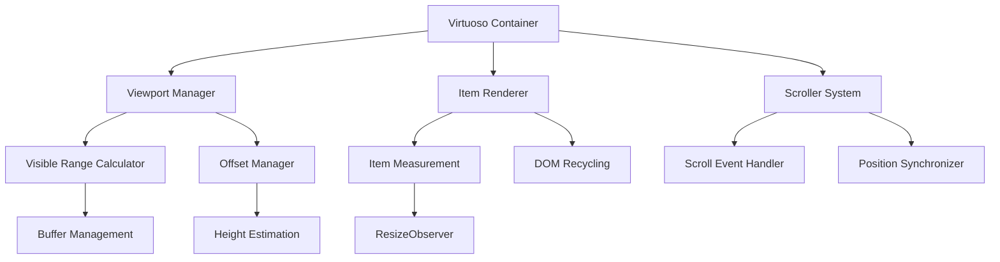
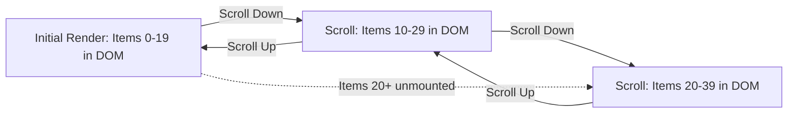

# React Virtuoso: Deep Dive into Virtual Scrolling

_Master React Virtuoso's virtualization engine, covering implementation details, offset management, variable height handling, and performance optimization strategies for building high-performance lists_

---

React Virtuoso is the most powerful virtual list component for React, providing efficient rendering of large datasets through sophisticated virtualization techniques. Unlike traditional approaches that render all items at once, Virtuoso renders only visible items plus a configurable buffer, dramatically improving performance and memory usage. This guide explores how React Virtuoso works under the hood, examining its core algorithms, offset management, variable height handling, and optimization strategies.

---

## Table of Contents

1. [Core Virtualization Concepts](#core-virtualization-concepts)
2. [Architecture Overview](#architecture-overview)
3. [Viewport Management](#viewport-management)
4. [Offset Calculation & Management](#offset-calculation--management)
5. [Variable Height Item Handling](#variable-height-item-handling)
6. [Scroll Synchronization](#scroll-synchronization)
7. [Performance Optimization Strategies](#performance-optimization-strategies)
8. [Component Variants](#component-variants)
9. [Advanced Features](#advanced-features)
10. [Common Patterns & Best Practices](#common-patterns--best-practices)

---

## Core Virtualization Concepts

### What is Virtualization?

Virtualization is a rendering optimization technique that renders only the items currently visible in the viewport, plus a small buffer of items above and below for smooth scrolling. This approach transforms O(n) rendering complexity to O(1) relative to the total dataset size.

```jsx
// Traditional approach - renders ALL items (performance killer)
function TraditionalList({ items }) {
  return (
    <div style={{ height: "400px", overflow: "auto" }}>
      {items.map((item, index) => (
        <div key={index}>{item.content}</div>
      ))}
    </div>
  );
}

// Virtualized approach - renders ONLY visible items
import { Virtuoso } from "react-virtuoso";

function VirtualizedList({ items }) {
  return (
    <Virtuoso
      style={{ height: "400px" }}
      totalCount={items.length}
      itemContent={(index) => <div>{items[index].content}</div>}
    />
  );
}
```

### Key Benefits

- **Memory Efficiency**: DOM contains only visible items (~10-50 elements instead of thousands)
- **Consistent Performance**: Rendering time remains constant regardless of dataset size
- **Smooth Scrolling**: Optimized rendering pipeline prevents janky scroll behavior
- **Variable Heights**: Automatic measurement and adjustment for dynamic content

---

## Architecture Overview

React Virtuoso's architecture consists of several interconnected systems working together to provide seamless virtualization:

### Core Components



### State Management System

Virtuoso uses a reactive state management system that efficiently updates only necessary parts when data changes:

```jsx
// Simplified internal state structure
const virtuosoState = {
  // Viewport dimensions
  viewportHeight: 400,
  scrollTop: 0,

  // Item management
  totalCount: 10000,
  visibleRange: { start: 45, end: 65 },
  overscan: { start: 40, end: 70 },

  // Height tracking
  itemHeights: new Map(), // Measured heights
  estimatedItemHeight: 50,
  totalHeight: 500000,

  // Offset calculations
  itemOffsets: new Map(), // Cached positions
  scrollOffset: 2250,
};
```

---

## Viewport Management

### Visible Range Calculation

The viewport manager determines which items should be rendered based on scroll position and container dimensions:

```jsx
// Simplified visible range calculation algorithm
function calculateVisibleRange(
  scrollTop,
  viewportHeight,
  itemOffsets,
  totalCount
) {
  // Find first visible item using binary search for efficiency
  const startIndex = binarySearchFirstVisible(scrollTop, itemOffsets);

  // Calculate end index based on viewport height
  let endIndex = startIndex;
  let accumulatedHeight = 0;

  while (endIndex < totalCount && accumulatedHeight < viewportHeight) {
    accumulatedHeight += getItemHeight(endIndex, itemOffsets);
    endIndex++;
  }

  return { start: startIndex, end: endIndex };
}

function binarySearchFirstVisible(scrollTop, itemOffsets) {
  let left = 0;
  let right = itemOffsets.size - 1;

  while (left < right) {
    const mid = Math.floor((left + right) / 2);
    const offset = itemOffsets.get(mid) || 0;

    if (offset < scrollTop) {
      left = mid + 1;
    } else {
      right = mid;
    }
  }

  return left;
}
```

### Overscan (Buffer) Management

Virtuoso renders additional items outside the visible area to ensure smooth scrolling:

```jsx
// Overscan configuration affects performance vs smoothness trade-off
<Virtuoso
  totalCount={10000}
  itemContent={(index) => <Item key={index} />}
  // Render 5 extra items above and below visible area
  increaseViewportBy={{ top: 200, bottom: 200 }}
  // Alternative: specify item count
  overscan={5}
/>
```

**Overscan Strategy:**

- **Small overscan** (2-5 items): Better performance, potential scroll stuttering
- **Large overscan** (10-20 items): Smoother scrolling, higher memory usage
- **Dynamic overscan**: Adjusts based on scroll velocity

---

## Offset Calculation & Management

### Height-Based Offset System

React Virtuoso maintains a sophisticated offset calculation system that tracks the position of each item:

```jsx
// Internal offset management system
class OffsetManager {
  constructor() {
    this.itemHeights = new Map();
    this.itemOffsets = new Map();
    this.totalHeight = 0;
    this.estimatedItemHeight = 50;
  }

  // Calculate offset for a specific item
  getItemOffset(index) {
    if (this.itemOffsets.has(index)) {
      return this.itemOffsets.get(index);
    }

    // Calculate offset based on previous items
    let offset = 0;
    for (let i = 0; i < index; i++) {
      offset += this.getItemHeight(i);
    }

    this.itemOffsets.set(index, offset);
    return offset;
  }

  // Get item height (measured or estimated)
  getItemHeight(index) {
    return this.itemHeights.get(index) || this.estimatedItemHeight;
  }

  // Update height and recalculate offsets
  setItemHeight(index, height) {
    const oldHeight = this.getItemHeight(index);
    this.itemHeights.set(index, height);

    // Invalidate cached offsets for items after this one
    this.invalidateOffsetsAfter(index);

    // Update total height
    this.totalHeight += height - oldHeight;
  }

  invalidateOffsetsAfter(index) {
    for (let i = index + 1; i < this.totalCount; i++) {
      this.itemOffsets.delete(i);
    }
  }
}
```

### Efficient Offset Updates

When item heights change, Virtuoso efficiently updates only affected offsets:

```jsx
// Example: Item height changes from 100px to 150px at index 25
// Before: [0, 100, 200, 300, ..., 2500, 2600, ...]
// After:  [0, 100, 200, 300, ..., 2500, 2650, ...] (+50px offset for items after 25)

function handleHeightChange(index, newHeight, oldHeight) {
  const heightDelta = newHeight - oldHeight;

  // Update stored height
  this.itemHeights.set(index, newHeight);

  // Efficiently update subsequent offsets
  for (let i = index + 1; i < this.totalCount; i++) {
    if (this.itemOffsets.has(i)) {
      const currentOffset = this.itemOffsets.get(i);
      this.itemOffsets.set(i, currentOffset + heightDelta);
    }
  }

  // Update total scrollable height
  this.totalHeight += heightDelta;

  // Adjust scroll position if necessary to maintain view stability
  this.adjustScrollPosition(index, heightDelta);
}
```

---

## Variable Height Item Handling

### Automatic Height Measurement

React Virtuoso automatically measures item heights using the ResizeObserver API:

```jsx
// Simplified height measurement system
function ItemRenderer({ index, style, data }) {
  const itemRef = useRef(null);
  const measureHeight = useCallback(() => {
    if (itemRef.current) {
      const height = itemRef.current.getBoundingClientRect().height;
      // Report height back to Virtuoso's measurement system
      reportItemHeight(index, height);
    }
  }, [index]);

  useEffect(() => {
    // Initial measurement
    measureHeight();

    // Set up ResizeObserver for dynamic content
    const resizeObserver = new ResizeObserver((entries) => {
      for (const entry of entries) {
        const height = entry.borderBoxSize[0].blockSize;
        reportItemHeight(index, height);
      }
    });

    if (itemRef.current) {
      resizeObserver.observe(itemRef.current);
    }

    return () => resizeObserver.disconnect();
  }, [measureHeight]);

  return (
    <div ref={itemRef} style={style}>
      {data[index].content}
    </div>
  );
}
```

### Dynamic Height Estimation

For unmeasured items, Virtuoso uses intelligent height estimation:

```jsx
// Height estimation strategies
class HeightEstimator {
  constructor() {
    this.measuredHeights = [];
    this.estimatedHeight = 50; // Initial estimate
  }

  // Update estimation based on measured items
  updateEstimation(newHeight) {
    this.measuredHeights.push(newHeight);

    // Use different strategies based on data availability
    if (this.measuredHeights.length < 10) {
      // Simple average for small samples
      this.estimatedHeight = this.calculateSimpleAverage();
    } else {
      // Weighted average favoring recent measurements
      this.estimatedHeight = this.calculateWeightedAverage();
    }
  }

  calculateWeightedAverage() {
    const recentHeights = this.measuredHeights.slice(-20); // Last 20 measurements
    const weights = recentHeights.map((_, i) => i + 1); // Newer items get higher weight

    const weightedSum = recentHeights.reduce(
      (sum, height, i) => sum + height * weights[i],
      0
    );
    const totalWeight = weights.reduce((sum, weight) => sum + weight, 0);

    return weightedSum / totalWeight;
  }
}
```

### Handling Content Loading

React Virtuoso gracefully handles scenarios where content loads asynchronously:

```jsx
// Example: Images loading in list items
function ImageListItem({ index, data }) {
  const [imageLoaded, setImageLoaded] = useState(false);
  const itemRef = useRef(null);

  // Re-measure when image loads
  const handleImageLoad = useCallback(() => {
    setImageLoaded(true);
    // Trigger re-measurement
    if (itemRef.current) {
      const height = itemRef.current.offsetHeight;
      // This will trigger Virtuoso's height update system
      requestAnimationFrame(() => {
        reportHeightChange(index, height);
      });
    }
  }, [index]);

  return (
    <div ref={itemRef}>
      <h3>{data[index].title}</h3>
      
      <p>{data[index].description}</p>
    </div>
  );
}
```

---

## Scroll Synchronization

### Scroll Event Handling

Virtuoso optimizes scroll event handling using requestAnimationFrame and throttling:

```jsx
// Optimized scroll handling system
class ScrollManager {
  constructor() {
    this.isScrolling = false;
    this.scrollRaf = null;
    this.lastScrollTime = 0;
  }

  handleScroll = (event) => {
    const now = performance.now();

    // Throttle scroll events for performance
    if (now - this.lastScrollTime < 16) {
      // ~60fps
      return;
    }

    this.lastScrollTime = now;

    // Cancel previous frame if still pending
    if (this.scrollRaf) {
      cancelAnimationFrame(this.scrollRaf);
    }

    // Schedule update for next frame
    this.scrollRaf = requestAnimationFrame(() => {
      this.updateScrollPosition(event.target.scrollTop);
      this.scrollRaf = null;
    });
  };

  updateScrollPosition(scrollTop) {
    // Update visible range
    const newVisibleRange = this.calculateVisibleRange(scrollTop);

    // Only update if range actually changed
    if (!this.rangesEqual(newVisibleRange, this.currentVisibleRange)) {
      this.currentVisibleRange = newVisibleRange;
      this.notifyRangeChange(newVisibleRange);
    }
  }
}
```

### Scroll Position Preservation

When items change height, Virtuoso maintains scroll position relative to content:

```jsx
// Scroll position preservation during height changes
function preserveScrollPosition(heightChanges) {
  const currentScrollTop = this.scrollContainer.scrollTop;
  const currentFirstVisibleIndex = this.findFirstVisibleIndex(currentScrollTop);

  // Apply height changes and recalculate offsets
  this.applyHeightChanges(heightChanges);

  // Calculate new scroll position to maintain visual stability
  const newScrollTop = this.getItemOffset(currentFirstVisibleIndex);

  // Smoothly adjust scroll position
  this.scrollContainer.scrollTop = newScrollTop;
}
```

### Programmatic Scrolling

Virtuoso provides methods for programmatic scrolling with smooth animations:

```jsx
// Scroll to specific item with options
<Virtuoso
  ref={virtuosoRef}
  totalCount={items.length}
  itemContent={(index) => <Item data={items[index]} />}
/>;

// Usage examples
function scrollToItem() {
  // Instant scroll to item 100
  virtuosoRef.current?.scrollToIndex({
    index: 100,
    align: "start", // 'start' | 'center' | 'end'
  });

  // Smooth scroll to item 500
  virtuosoRef.current?.scrollToIndex({
    index: 500,
    align: "center",
    behavior: "smooth",
  });

  // Scroll to item only if not already visible
  virtuosoRef.current?.scrollIntoView({
    index: 250,
    done: () => console.log("Scroll completed"),
  });
}
```

---

## Performance Optimization Strategies

### Memoization and React.memo

Optimize item rendering using React.memo and proper dependency management:

```jsx
// Optimized item component with memoization
const ListItem = React.memo(function ListItem({
  index,
  data,
  isSelected,
  onSelect,
}) {
  const item = data[index];

  // Memoize click handler to prevent unnecessary re-renders
  const handleClick = useCallback(() => {
    onSelect(item.id);
  }, [item.id, onSelect]);

  // Memoize computed styles
  const itemStyle = useMemo(
    () => ({
      padding: "12px",
      borderBottom: "1px solid #eee",
      backgroundColor: isSelected ? "#e3f2fd" : "transparent",
      cursor: "pointer",
    }),
    [isSelected]
  );

  return (
    <div style={itemStyle} onClick={handleClick}>
      <h4>{item.title}</h4>
      <p>{item.description}</p>
    </div>
  );
});

// Usage with proper prop comparison
function App() {
  const [selectedId, setSelectedId] = useState(null);

  // Memoize selection handler
  const handleSelect = useCallback((id) => {
    setSelectedId(id);
  }, []);

  return (
    <Virtuoso
      totalCount={items.length}
      itemContent={(index) => (
        <ListItem
          index={index}
          data={items}
          isSelected={items[index].id === selectedId}
          onSelect={handleSelect}
        />
      )}
    />
  );
}
```

### Overscan Tuning

Balance performance vs. smoothness by adjusting overscan parameters:

```jsx
// Performance-focused configuration (minimal overscan)
<Virtuoso
  totalCount={items.length}
  itemContent={renderItem}
  overscan={2} // Minimal buffer for better performance
/>

// Smoothness-focused configuration (larger overscan)
<Virtuoso
  totalCount={items.length}
  itemContent={renderItem}
  increaseViewportBy={{
    top: 300,    // Render 300px worth of items above viewport
    bottom: 300  // Render 300px worth of items below viewport
  }}
/>

// Dynamic overscan based on scroll velocity
<Virtuoso
  totalCount={items.length}
  itemContent={renderItem}
  overscan={(velocity) => {
    // More overscan for faster scrolling
    return Math.min(Math.floor(Math.abs(velocity) / 100), 20);
  }}
/>
```

### CSS Optimization

Optimize CSS to work well with virtualization:

```css
/* Avoid margins on items - use padding instead */
.list-item {
  padding: 12px; /* ✅ Good - doesn't interfere with measurements */
  /* margin: 12px; ❌ Bad - can cause measurement issues */
}

/* Use transform for positioning when possible */
.item-container {
  will-change: transform; /* Optimize for frequent changes */
  contain: layout style paint; /* CSS containment for better performance */
}

/* Optimize for GPU acceleration */
.smooth-item {
  transform: translateZ(0); /* Force GPU layer */
  backface-visibility: hidden;
}
```

---

## Component Variants

### Virtuoso (Basic List)

The standard virtualized list component:

```jsx
import { Virtuoso } from "react-virtuoso";

function BasicList({ items }) {
  return (
    <Virtuoso
      style={{ height: "400px" }}
      totalCount={items.length}
      itemContent={(index) => (
        <div style={{ padding: "12px", borderBottom: "1px solid #eee" }}>
          {items[index].content}
        </div>
      )}
      // Optional customizations
      components={{
        Header: () => <div>List Header</div>,
        Footer: () => <div>List Footer</div>,
        EmptyPlaceholder: () => <div>No items found</div>,
      }}
    />
  );
}
```

### GroupedVirtuoso (Grouped Lists)

For lists with group headers and categorized content:

```jsx
import { GroupedVirtuoso } from "react-virtuoso";

function GroupedList({ groups }) {
  // Group structure: [{ title: 'Group 1', items: [...] }, ...]
  const groupCounts = groups.map((group) => group.items.length);

  return (
    <GroupedVirtuoso
      style={{ height: "400px" }}
      groupCounts={groupCounts}
      groupContent={(index) => (
        <div
          style={{
            padding: "8px 12px",
            backgroundColor: "#f5f5f5",
            fontWeight: "bold",
            position: "sticky",
            top: 0,
            zIndex: 1,
          }}
        >
          {groups[index].title}
        </div>
      )}
      itemContent={(index, groupIndex) => (
        <div style={{ padding: "12px", borderBottom: "1px solid #eee" }}>
          {groups[groupIndex].items[index].content}
        </div>
      )}
    />
  );
}
```

### VirtuosoGrid (Grid Layout)

For responsive grid layouts with equal-sized items:

```jsx
import { VirtuosoGrid } from 'react-virtuoso';

function ResponsiveGrid({ items }) {
  return (
    <VirtuosoGrid
      style={{ height: '400px' }}
      totalCount={items.length}
      itemContent={index => (
        <div style={{
          padding: '8px',
          border: '1px solid #ddd',
          borderRadius: '4px',
          height: '200px' // Fixed height for grid items
        }}>
          
          <h4>{items[index].title}</h4>
        </div>
      )}
      listClassName="grid-container"
    />
  );
}

/* CSS for responsive grid */
.grid-container {
  display: grid;
  grid-template-columns: repeat(auto-fill, minmax(200px, 1fr));
  gap: 16px;
  padding: 16px;
}
```

### TableVirtuoso (Table Virtualization)

For large tables with virtualized rows:

```jsx
import { TableVirtuoso } from "react-virtuoso";

function VirtualizedTable({ data, columns }) {
  return (
    <TableVirtuoso
      style={{ height: "400px" }}
      data={data}
      components={{
        Table: (props) => (
          <table {...props} style={{ borderCollapse: "collapse" }} />
        ),
        TableHead: React.forwardRef((props, ref) => (
          <thead {...props} ref={ref} />
        )),
        TableRow: (props) => (
          <tr {...props} style={{ borderBottom: "1px solid #ddd" }} />
        ),
        TableBody: React.forwardRef((props, ref) => (
          <tbody {...props} ref={ref} />
        )),
      }}
      fixedHeaderContent={() => (
        <tr>
          {columns.map((col) => (
            <th
              key={col.key}
              style={{
                padding: "12px",
                backgroundColor: "#f5f5f5",
                position: "sticky",
                top: 0,
              }}
            >
              {col.title}
            </th>
          ))}
        </tr>
      )}
      itemContent={(index, item) => (
        <>
          {columns.map((col) => (
            <td key={col.key} style={{ padding: "12px" }}>
              {item[col.key]}
            </td>
          ))}
        </>
      )}
    />
  );
}
```

---

## Advanced Features

### Message List for Chat Applications

Specialized component for chat/message interfaces:

```jsx
import { VirtuosoMessageList } from "@virtuoso.dev/message-list";

function ChatInterface() {
  const [messages, setMessages] = useState([]);

  return (
    <VirtuosoMessageList
      initialData={messages}
      itemContent={(index, message) => (
        <div
          style={{
            padding: "8px 12px",
            maxWidth: "70%",
            marginLeft: message.isOwn ? "auto" : "0",
            marginRight: message.isOwn ? "0" : "auto",
            backgroundColor: message.isOwn ? "#007bff" : "#e9ecef",
            color: message.isOwn ? "white" : "black",
            borderRadius: "12px",
            marginBottom: "4px",
          }}
        >
          {message.text}
        </div>
      )}
      // Auto-scroll to bottom for new messages
      followOutput="smooth"
      // Handle loading older messages
      startReached={() => loadOlderMessages()}
    />
  );
}
```

### Infinite Scrolling

Implement infinite scrolling with data loading:

```jsx
function InfiniteScrollList() {
  const [items, setItems] = useState([]);
  const [loading, setLoading] = useState(false);
  const [hasMore, setHasMore] = useState(true);

  const loadMore = useCallback(async () => {
    if (loading || !hasMore) return;

    setLoading(true);
    try {
      const newItems = await fetchMoreData(items.length);
      setItems((prev) => [...prev, ...newItems]);
      setHasMore(newItems.length > 0);
    } finally {
      setLoading(false);
    }
  }, [items.length, loading, hasMore]);

  return (
    <Virtuoso
      style={{ height: "400px" }}
      totalCount={hasMore ? items.length + 1 : items.length}
      itemContent={(index) => {
        if (index === items.length) {
          return (
            <div style={{ padding: "20px", textAlign: "center" }}>
              {loading ? "Loading..." : "Load More"}
            </div>
          );
        }
        return <Item data={items[index]} />;
      }}
      endReached={loadMore}
      // Preload when user is near the end
      overscan={5}
    />
  );
}
```

### Custom Scrollbars

Implement custom scrollbar styling:

```jsx
<Virtuoso
  style={{ height: '400px' }}
  totalCount={items.length}
  itemContent={renderItem}
  components={{
    Scroller: React.forwardRef((props, ref) => (
      <div
        {...props}
        ref={ref}
        style={{
          ...props.style,
          // Custom scrollbar styles
          scrollbarWidth: 'thin',
          scrollbarColor: '#888 #f1f1f1'
        }}
        className="custom-scrollbar"
      />
    ))
  }}
/>

/* CSS for webkit browsers */
.custom-scrollbar::-webkit-scrollbar {
  width: 8px;
}

.custom-scrollbar::-webkit-scrollbar-track {
  background: #f1f1f1;
  border-radius: 4px;
}

.custom-scrollbar::-webkit-scrollbar-thumb {
  background: #888;
  border-radius: 4px;
}

.custom-scrollbar::-webkit-scrollbar-thumb:hover {
  background: #555;
}
```

---

## Common Patterns & Best Practices

### Error Boundaries

Wrap virtualized lists with error boundaries:

```jsx
class VirtuosoErrorBoundary extends React.Component {
  constructor(props) {
    super(props);
    this.state = { hasError: false };
  }

  static getDerivedStateFromError(error) {
    return { hasError: true };
  }

  componentDidCatch(error, errorInfo) {
    console.error("Virtuoso error:", error, errorInfo);
  }

  render() {
    if (this.state.hasError) {
      return (
        <div style={{ padding: "20px", textAlign: "center" }}>
          <h3>Something went wrong rendering the list</h3>
          <button onClick={() => this.setState({ hasError: false })}>
            Try Again
          </button>
        </div>
      );
    }

    return this.props.children;
  }
}

// Usage
function App() {
  return (
    <VirtuosoErrorBoundary>
      <Virtuoso totalCount={items.length} itemContent={renderItem} />
    </VirtuosoErrorBoundary>
  );
}
```

### Testing Strategies

Test virtualized components effectively:

```jsx
import { render, screen } from "@testing-library/react";
import { Virtuoso } from "react-virtuoso";

// Mock intersection observer for tests
beforeAll(() => {
  global.IntersectionObserver = jest.fn(() => ({
    observe: jest.fn(),
    disconnect: jest.fn(),
    unobserve: jest.fn(),
  }));
});

test("renders visible items correctly", async () => {
  const items = Array.from({ length: 1000 }, (_, i) => ({
    id: i,
    content: `Item ${i}`,
  }));

  render(
    <Virtuoso
      style={{ height: "400px" }}
      totalCount={items.length}
      itemContent={(index) => (
        <div data-testid={`item-${index}`}>{items[index].content}</div>
      )}
    />
  );

  // Only visible items should be rendered
  expect(screen.queryByTestId("item-0")).toBeInTheDocument();
  expect(screen.queryByTestId("item-999")).not.toBeInTheDocument();
});
```

### Performance Monitoring

Monitor virtualization performance:

```jsx
function useVirtuosoPerformance() {
  const [metrics, setMetrics] = useState({});

  const onScroll = useCallback((scrollTop) => {
    const start = performance.now();

    // Measure scroll handling time
    requestAnimationFrame(() => {
      const duration = performance.now() - start;
      setMetrics((prev) => ({
        ...prev,
        scrollHandlingTime: duration,
        lastScrollTop: scrollTop,
      }));
    });
  }, []);

  return { metrics, onScroll };
}

// Usage
function MonitoredList() {
  const { metrics, onScroll } = useVirtuosoPerformance();

  return (
    <>
      <div>Scroll handling: {metrics.scrollHandlingTime?.toFixed(2)}ms</div>
      <Virtuoso
        totalCount={items.length}
        itemContent={renderItem}
        onScroll={onScroll}
      />
    </>
  );
}
```

### Accessibility Considerations

Ensure virtualized lists are accessible:

```jsx
<Virtuoso
  style={{ height: "400px" }}
  totalCount={items.length}
  itemContent={(index) => (
    <div
      role="listitem"
      aria-setsize={items.length}
      aria-posinset={index + 1}
      tabIndex={0}
      onKeyDown={(e) => {
        if (e.key === "Enter" || e.key === " ") {
          handleItemSelect(index);
        }
      }}
    >
      {items[index].content}
    </div>
  )}
  components={{
    List: React.forwardRef((props, ref) => (
      <div
        {...props}
        ref={ref}
        role="list"
        aria-label="Virtualized item list"
      />
    )),
  }}
/>
```

---

## How React Virtuoso Handles and Renders Items to the DOM

React Virtuoso employs a highly optimized approach to DOM rendering, ensuring that only the necessary elements are present in the DOM at any given time, regardless of the total dataset size. Here’s a detailed look at how Virtuoso manages this process:

### Visualizing the DOM Lifecycle



- **A**: Only the first 20 items are rendered.
- **B**: As you scroll, the DOM updates to show the next 20 items, unmounting those that left the buffer.
- **C**: Further scrolling continues this process, always keeping the DOM size small.

### Example: DOM Node Recycling and Buffer Management

```jsx
import { Virtuoso } from "react-virtuoso";

function LoggingList({ items }) {
  // This ref logs when items mount/unmount
  const Item = ({ index }) => {
    useEffect(() => {
      console.log(`MOUNT: Item ${index}`);
      return () => console.log(`UNMOUNT: Item ${index}`);
    }, [index]);
    return <div>Item {index}: {items[index].content}</div>;
  };

  return (
    <Virtuoso
      style={{ height: 300 }}
      totalCount={items.length}
      itemContent={index => <Item index={index} />}
      overscan={5} // buffer of 5 items above/below
    />
  );
}
```

**Console Output Example:**
```
MOUNT: Item 0
MOUNT: Item 1
...
MOUNT: Item 19
// User scrolls down
UNMOUNT: Item 0
MOUNT: Item 20
...
```
This shows how Virtuoso mounts only visible/buffered items and unmounts those that leave the buffer, keeping the DOM light.

### Internal Buffer and Recycling Logic (Pseudocode)

```js
function updateVisibleItems(scrollTop, viewportHeight, buffer, totalCount) {
  const start = Math.max(0, findFirstVisible(scrollTop) - buffer);
  const end = Math.min(totalCount, findLastVisible(scrollTop, viewportHeight) + buffer);
  // Only items in [start, end) are mounted
  return { start, end };
}
```

### 1. **Viewport-Driven Rendering**
- **Visible Range Calculation:** Virtuoso continuously calculates which items are visible in the viewport based on the current scroll position and container height. This is achieved using efficient algorithms (like binary search) to quickly determine the first and last visible items.
- **Buffer/Overscan:** To ensure smooth scrolling, Virtuoso renders a configurable buffer (overscan) of items above and below the visible range. This prevents blank spaces during fast scrolls and allows for seamless user experience.

### 2. **DOM Recycling and Element Lifecycle**
- **Minimal DOM Nodes:** Only the items within the visible range (plus buffer) are mounted in the DOM. For example, in a list of 10,000 items, the DOM might only contain 20-50 elements at any time.
- **Element Reuse:** As the user scrolls, Virtuoso reuses existing DOM nodes for new data, minimizing mounting/unmounting overhead. This recycling is managed internally, so React’s reconciliation is optimized for performance.
- **Unmounting:** Items that scroll out of the overscan buffer are unmounted, freeing up memory and reducing layout/repaint costs.

### 3. **Dynamic Measurement and Positioning**
- **Automatic Height Measurement:** Virtuoso uses the ResizeObserver API to measure the height of each rendered item. This allows it to handle variable-height content without manual configuration.
- **Offset Calculation:** The measured heights are used to calculate the offset (distance from the top) for each item. This ensures that each item is positioned accurately within the scrollable container, even as heights change dynamically.
- **Efficient Updates:** When an item’s height changes (e.g., due to image loading), only the affected offsets and DOM nodes are updated, preserving scroll position and visual stability.

### 4. **Rendering Pipeline**
- **Render Pass:** On each scroll event (throttled and optimized with requestAnimationFrame), Virtuoso determines the new visible range and updates the DOM accordingly.
- **State Synchronization:** The internal state tracks which items are currently rendered, their heights, and their offsets. This state is updated reactively, ensuring that only necessary changes trigger re-renders.
- **Programmatic Control:** Developers can programmatically scroll to specific items, and Virtuoso will ensure the correct DOM nodes are rendered and positioned.

### 5. **Performance and Best Practices**
- **O(1) Rendering Complexity:** The number of DOM nodes remains constant regardless of list size, transforming rendering complexity from O(n) to O(1).
- **CSS Optimization:** Virtuoso recommends using padding instead of margins for item spacing, and leveraging CSS containment and GPU acceleration for optimal performance.
- **Error Boundaries:** Wrapping Virtuoso in an error boundary ensures that rendering errors do not crash the entire app.

### 6. **Example: DOM Rendering Lifecycle**
1. **Initial Render:** Only the items visible in the viewport (plus buffer) are rendered to the DOM.
2. **Scroll Event:** As the user scrolls, Virtuoso calculates the new visible range and updates the DOM, recycling nodes as needed.
3. **Height Change:** If an item’s height changes, Virtuoso re-measures and updates offsets, adjusting the scroll position if necessary to maintain visual stability.
4. **Unmounting:** Items that move out of the overscan buffer are unmounted from the DOM.

### Visual Example: What the DOM Looks Like During Virtualization

When Virtuoso renders a large list, the DOM structure looks like this:

```html
<div class="virtuoso-scroller" style="overflow: auto; height: 400px;">
  <div class="virtuoso-item-list" style="position: relative;">
    
    <!-- Top spacer for items 0–49 -->
    <div style="height: 2400px;"></div>
    
    <!-- Rendered items (50–60) -->
    <div style="position: absolute; top: 2400px; height: 48px;">Item 50</div>
    <div style="position: absolute; top: 2448px; height: 48px;">Item 51</div>
    <div style="position: absolute; top: 2496px; height: 48px;">Item 52</div>
    ...
    <div style="position: absolute; top: 2928px; height: 48px;">Item 60</div>
    
    <!-- Bottom spacer for items after 60 -->
    <div style="height: 1000px;"></div>
  </div>
</div>
```

- The **top spacer** simulates the space taken by all items above the visible window (items 0–49).
- The **rendered items** (50–60) are absolutely positioned at their calculated offsets.
- The **bottom spacer** simulates the space for all items after the rendered window.

This structure allows the scroll bar to reflect the full list height, while only a small subset of items are actually in the DOM.

---

For a more in-depth technical breakdown, see the [shared ChatGPT resource](https://chatgpt.com/share/689a2e39-c320-8007-bd6b-b194996873cb) and the [official documentation](https://virtuoso.dev/).

## Conclusion

React Virtuoso represents a sophisticated approach to handling large datasets in React applications. Its automatic height measurement, efficient offset management, and smooth scrolling capabilities make it an excellent choice for performance-critical applications. By understanding its internal mechanisms—from viewport management to variable height handling—developers can leverage its full potential while avoiding common pitfalls.

Key takeaways:

- **Virtualization transforms O(n) to O(1)** rendering complexity
- **Automatic height measurement** eliminates manual configuration
- **Smart offset calculation** maintains scroll position accuracy
- **Proper memoization** is crucial for optimal performance
- **Component variants** address different use cases efficiently

Whether building chat interfaces, data tables, or image galleries, React Virtuoso provides the tools needed to create smooth, performant user experiences at any scale.

Further reading: [React Virtuoso Documentation](https://virtuoso.dev/) | [GitHub Repository](https://github.com/petyosi/react-virtuoso)
